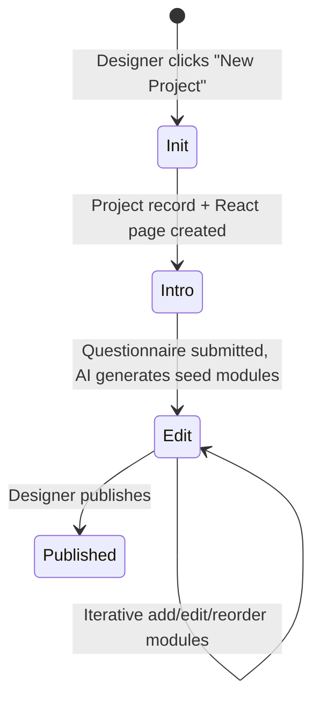
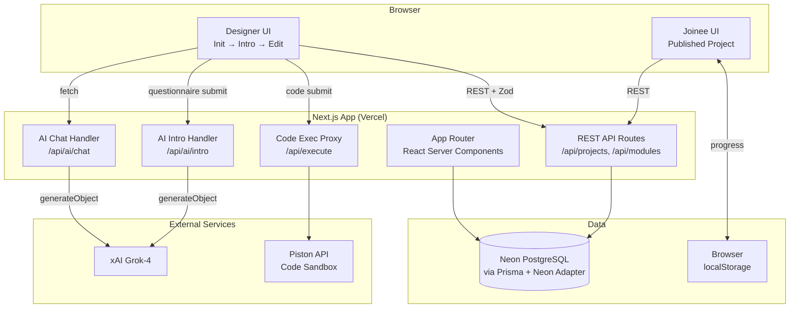

# Design Document: Onboarding Project Builder

## Overview

**Product Thesis**: AI-generated structured onboarding in 30 minutes vs. 15–30 hours manually — with interactive diagrams, sandboxed code exercises, and zero-friction Joinee access that no wiki-based tool can match.

The Onboarding Project Builder is a full-stack web application that enables businesses (Designers — HR leads, team managers, L&D professionals) to create rich, interactive onboarding experiences for new employees (Joinees). Every project passes through three sequential stages: **Init** (scaffold), **Intro** (AI-seeded questionnaire), and **Edit** (iterative module workspace). Designers converse with an AI assistant during the Edit stage to refine structured onboarding projects composed of rich text, interactive visuals (Mermaid diagrams), and embedded code editors. Joinees consume the published projects through a shareable, account-free URL.

**Product Thesis**: AI-generated structured onboarding in 30 minutes vs. 15–30 hours manually — with interactive diagrams, sandboxed code exercises, and zero-friction Joinee access that no wiki-based tool can match.

### Demo-Day Success Criteria

At demo day, a judge should be able to: (1) create a new project from the dashboard, (2) fill out the Intro questionnaire and see AI-generated module stubs appear in under 30 seconds, (3) chat with the AI to add a rich text module, a Mermaid diagram, and a code exercise, approving each change, (4) click Publish and receive a shareable URL, (5) open that URL in an incognito tab (no account) and complete all modules with progress tracking. The entire flow should take under 5 minutes. If AI or Piston are unavailable, the pre-populated demo project demonstrates all three module types, the publish flow, and the Joinee experience without any external dependencies.

### Tech Stack

| Layer | Technology | Justification |
|---|---|---|
| Frontend Framework | **Next.js 14 (App Router)** | Server components reduce client bundle size; built-in API routes eliminate a separate backend service; excellent Vercel deployment story |
| Language | **TypeScript** | End-to-end type safety across frontend and backend |
| Styling | **Tailwind CSS + Radix UI** | Rapid UI development with accessible, composable primitives (Dialog, Dropdown, ScrollArea, Select, Separator, Tooltip) |
| API Layer | **REST Route Handlers + Zod** | Next.js App Router route handlers with Zod input validation on all endpoints; `.strict()` schemas prevent unintended field writes |
| AI Integration | **Vercel AI SDK (`ai` package)** | Provider-agnostic structured output; `generateObject` produces Zod-validated JSON from the LLM in a single call |
| LLM Provider | **xAI Grok-4** | Strong instruction-following for structured content generation; reliable JSON mode output via `generateObject` |
| ORM | **Prisma** | Type-safe database client; schema-first migrations; Neon serverless adapter via `@prisma/adapter-neon` |
| Database | **Neon PostgreSQL (serverless)** | Serverless Postgres with automatic connection pooling via `@neondatabase/serverless`; scales to zero; JSONB columns for flexible module content |
| Code Execution | **Piston API** | Open-source, sandboxed, multi-language execution engine; supports Python, JavaScript, TypeScript; self-hostable via `PISTON_API_URL` env var |
| Interactive Visuals | **Mermaid.js** | Text-to-diagram rendering; AI can generate Mermaid syntax reliably (appears extensively in training data); supports flowcharts, sequence diagrams, and annotated steps |
| Code Editor | **Monaco Editor (`@monaco-editor/react`)** | VS Code-grade editing experience; syntax highlighting for Python/JS/TS; lazy-loaded with `next/dynamic({ ssr: false })` |
| Rich Text | **Tiptap** | Headless, extensible rich text editor; React-native; ProseMirror-based |
| State Management | **Zustand** | Lightweight client state for project data, editor UI state, and chat history (three stores: `projectStore`, `editorStore`, `chatStore`) |
| Validation | **Zod** | Runtime schema validation on all REST endpoints and AI output schemas |
| Testing | **Vitest + fast-check** | Property-based testing with 100+ iterations per property; vitest for test runner |
| Deployment | **Vercel** | Zero-config Next.js deployment; edge functions for low-latency AI responses |

---

## Three-Stage Designer Workflow

Each project moves through three stages in sequence. The stage is stored on the `Project` record and gates which UI the Designer sees.



### Stage 1 — Init

**Trigger**: Designer submits the "New Project" form (title + description).

**What happens**:
1. `POST /api/projects` creates a `Project` row with `stage: "init"`.
2. The server scaffolds a blank project entry in the database.
3. The client is redirected to `/builder/[projectId]/intro`.

**Key constraint**: No modules exist yet. The project is a shell.

---

### Stage 2 — Intro

**Trigger**: Designer lands on `/builder/[projectId]/intro`.

**What happens**:
1. The `IntroQuestionnaire` component renders three sections:
   - **Goals** — free-text: "What should a new employee know or be able to do after completing this?"
   - **Baseline Requirements** — checklist + free-text: "What prior knowledge can you assume?"
   - **Examples** — file upload or URL paste: "Share any existing docs, slides, or references."
2. On submit, the answers are sent to `POST /api/ai/intro` along with a predefined system prompt (the "Intro Rules") that instructs the AI on how to structure a learning module for business onboarding.
3. The AI returns a `SeedLayout` — an ordered list of module stubs (type + title + brief description) — within 15 seconds.
4. The stubs are written to the database as `Module` rows with `content: null` (placeholders).
5. The project `stage` is updated to `"edit"`.
6. The client is redirected to `/builder/[projectId]/edit`.

**Intro Rules (predefined AI system prompt)**:
- Always start with a "Welcome & Overview" rich-text module.
- Group related concepts into no more than 5–7 modules per project.
- Include at least one interactive visual if the goals mention processes, flows, or structures.
- Include at least one code exercise if the goals mention technical skills.
- Keep module titles concise (≤ 6 words).

---

### Stage 3 — Edit

**Trigger**: Designer lands on `/builder/[projectId]/edit` (stage must be `"edit"`).

**What happens**:
1. The Builder workspace loads with the AI-seeded module stubs pre-populated in the `PreviewPanel`.
2. The Designer iteratively fills in and refines each module using:
   - **Direct manipulation**: click a module stub to open its inline editor (Tiptap / Monaco / Mermaid).
   - **AI chat**: type instructions in the `ChatPanel` to add, modify, or restructure modules.
3. Every accepted change is auto-saved within 5 seconds.
4. When satisfied, the Designer publishes the project.

**Goal-Alignment Scoring**: After each AI-generated change is approved, the system runs a lightweight goal-alignment check — a secondary `generateObject` call that compares the Intro questionnaire goals against the current module set and produces a coverage score (0–100%). The call runs asynchronously after `applyChange` completes — it does not block the approval flow. The score updates in the workspace status bar within 2–3 seconds of approval. The `GoalAlignmentScore` schema is: `z.object({ score: z.number().min(0).max(100), gaps: z.array(z.string()), suggestions: z.array(z.string()) })`. The call uses the same `xai("grok-3-mini")` model with a lightweight prompt containing only module titles/types and the original goals text (~500 tokens total). If the score drops below 70%, the system surfaces specific gap suggestions (e.g., "Your goals mention 'Git workflow' but no module covers version control"). This closes the feedback loop between the Designer's stated intent and the AI's output throughout the Edit stage.

### Mermaid Annotation Implementation

The Mermaid annotation system attaches interactive metadata to specific SVG node IDs. When Mermaid renders a diagram, each node gets a deterministic ID (e.g., `node-A`, `node-B`). The `annotations` array maps `nodeId` to `label` and `detail` strings. On render, the VisualModule component queries the SVG DOM for matching node IDs and attaches `mouseenter`/`mouseleave` event listeners that display a positioned tooltip with the annotation detail. This is non-trivial because Mermaid's SVG output structure varies by diagram type — flowcharts use `<g>` groups with class-based IDs, while sequence diagrams use `<rect>` elements with different naming conventions. The component normalizes both patterns via a `findNodeElement(svg, nodeId)` utility that tries multiple selector strategies before falling back to a text-content match.

---

## Architecture

The system follows a **monorepo, full-stack Next.js** architecture. The Next.js App Router handles both the React frontend and the backend API via REST Route Handlers with Zod validation. Neon serverless PostgreSQL stores all persistent data via Prisma with the `@prisma/adapter-neon` driver. The Piston API runs as a separate service (self-hosted or via the public endpoint) for sandboxed code execution.



### Key Architectural Decisions

**Decision 1: Monolithic Next.js with REST Route Handlers**
A single Next.js app with REST Route Handlers (not a separate Express/Fastify backend) is chosen. This reduces operational complexity for a business onboarding tool, keeps deployment simple (single Vercel project), and Zod schemas on every endpoint provide runtime type safety. All API routes follow RESTful conventions: `POST /api/projects`, `GET /api/projects/:id`, `PUT /api/modules/:id`, etc.

**Decision 2: Piston API for Code Execution**
Piston runs each submission in an isolated container with resource limits, satisfying the sandboxing requirement. The 15-second timeout is enforced at the proxy layer (`/api/execute`) before forwarding to Piston, giving us control independent of Piston's own limits.

**Decision 3: Mermaid.js for Interactive Visuals**
The AI can reliably generate Mermaid syntax (it appears in training data extensively). Mermaid renders to SVG in the browser, is responsive by default, and supports the required visual types (flowcharts, sequence diagrams, annotated steps). Custom click/hover interactivity is layered on top via Mermaid's `securityLevel` and event callbacks.

**Decision 4: Structured AI Output via `generateObject`**
Rather than asking the AI to return free-form text, the AI route uses Vercel AI SDK's `generateObject` with a Zod schema. This ensures the AI always returns a valid change object (module additions, edits, deletions) that can be directly applied to the project state. The schema uses a flat object design (not nested discriminated unions) to maximize AI compliance — a `cleanResponse()` post-processor strips cross-type fields.

**Decision 5: AI Context Management and Token Budget**
The Edit-stage system prompt injects the current `ProjectSnapshot` (module IDs, titles, types, and a content summary) into the AI context. As projects grow, the full content of all modules would exceed token limits. The truncation strategy is:
- **Module metadata is always included**: ID, title, type, and position for all modules (small, fixed-size per module).
- **Full content is included only for the active module** (the one the Designer is currently editing or referencing).
- **Other modules include a content summary**: for RICH_TEXT, the first 200 characters of HTML stripped of tags; for CODE_EDITOR, the language and first 5 lines of starterCode; for INTERACTIVE_VISUAL, the visualType and annotation count.
- **Conversation history is windowed**: only the last 8 messages are sent to the AI, keeping the total prompt under ~4,000 tokens of context even for a 20-module project.

At Grok-4's 128K context window, this strategy provides ample headroom. The `buildSystemPrompt(modules)` function in `prompts.ts` implements this truncation.

**`generateObject` Zod Retry Behavior**: When the AI returns a response that fails Zod validation, the system retries exactly once with the following amended system prompt appended: `"Your previous response failed schema validation. You MUST return a JSON object matching this exact structure: { changeType: 'add_module' | 'update_module' | 'delete_module', description: string, contentType: 'RICH_TEXT' | 'INTERACTIVE_VISUAL' | 'CODE_EDITOR', title?: string, moduleId?: string, ...fields for chosen contentType only }. Do NOT include fields from other content types. Do NOT wrap in markdown code blocks."` If the retry also fails, the route returns `{ error: "AI assistant temporarily unavailable." }` and the Designer's message is preserved in chat history for manual retry.

---

## Components and Interfaces

### Frontend Components

```
src/
├── app/
│   ├── dashboard/
│   │   └── page.tsx                        # Project list + create/delete
│   ├── builder/[projectId]/
│   │   ├── edit/page.tsx                   # Stage 3: Edit workspace
│   │   └── preview/page.tsx                # Full-page preview
│   ├── p/[slug]/
│   │   ├── page.tsx                        # Joinee public view (server component)
│   │   └── JoineeView.tsx                  # Joinee client component with progress
│   └── api/
│       ├── ai/chat/route.ts                # AI chat (generateObject + Zod)
│       ├── projects/route.ts               # Project list + create
│       ├── projects/[projectId]/route.ts   # Project CRUD
│       ├── projects/[projectId]/modules/route.ts  # Module create
│       ├── projects/[projectId]/publish/route.ts  # Publish with slug generation
│       ├── modules/[moduleId]/route.ts     # Module update + delete
│       └── execute/route.ts                # Code execution proxy (Piston)
├── components/
│   ├── editor/                             # Builder workspace (VS Code-inspired)
│   │   ├── EditWorkspace.tsx               # Main workspace shell
│   │   ├── ChatPanel.tsx                   # AI conversation interface
│   │   ├── EditorPanel.tsx                 # Module editor area
│   │   ├── InlinePreview.tsx               # Live preview panel
│   │   ├── ModuleExplorer.tsx              # Sidebar module list
│   │   ├── ModuleTabs.tsx                  # Tab bar for open modules
│   │   ├── ActivityBar.tsx                 # Left icon bar
│   │   ├── TitleBar.tsx                    # Top bar with publish button
│   │   └── StatusBar.tsx                   # Bottom status bar
│   ├── modules/                            # Module type editors
│   │   ├── RichTextModule.tsx              # Tiptap editor/viewer
│   │   ├── VisualModule.tsx                # Mermaid renderer + annotations
│   │   └── CodeEditorModule.tsx            # Monaco editor + run button
│   └── preview/                            # Joinee-facing renderers
│       ├── ProjectPage.tsx                 # Published project layout
│       ├── PreviewRichText.tsx             # Read-only rich text
│       ├── PreviewVisual.tsx               # Read-only Mermaid diagram
│       └── PreviewCode.tsx                 # Read-only code + run
├── lib/
│   ├── ai/
│   │   ├── schemas.ts                      # Zod schemas (ProposedChangeSchema, ModuleContentSchema)
│   │   └── prompts.ts                      # System prompt builder (buildSystemPrompt)
│   ├── store/
│   │   ├── projectStore.ts                 # Project + module state (hydrates from DB)
│   │   ├── editorStore.ts                  # UI/editor state
│   │   └── chatStore.ts                    # Chat message state
│   ├── types.ts                            # Shared TypeScript types (Project, Module, ModuleContent)
│   └── progress.ts                         # Joinee localStorage progress utilities
└── server/
    └── db/
        └── prisma.ts                       # Prisma client singleton (Neon adapter)
```

### REST API Endpoints

All endpoints use Zod input validation and return structured JSON error responses.

```
POST   /api/projects                        → Create project (Zod: title required, max 200 chars)
GET    /api/projects                        → List all projects with modules
GET    /api/projects/:id                    → Get project with modules (404 if not found)
PUT    /api/projects/:id                    → Update project metadata (Zod: .strict() prevents extra fields)
DELETE /api/projects/:id                    → Delete project (cascades to modules)

POST   /api/projects/:id/modules            → Add module (Zod: type enum, auto-assigns position)
PUT    /api/modules/:id                     → Update module (Zod: .strict())
DELETE /api/modules/:id                     → Delete module

POST   /api/projects/:id/publish            → Publish project (generates unique slug with retry)

POST   /api/ai/chat                         → AI chat (generateObject + Zod flat schema → cleanResponse)
POST   /api/ai/intro                        → AI intro seed (generateObject → SeedLayout)
POST   /api/execute                         → Code execution proxy (Zod: language enum + code string)
```

### AI Chat Route (`/api/ai/chat`)

`POST /api/ai/chat` — Accepts conversation history and current modules, returns a Zod-validated change object via `generateObject`.

```typescript
// Request body
{
  messages: Array<{ role: "user" | "assistant"; content: string }>;
  modules: Module[];           // current project modules for AI context
  forceType?: "RICH_TEXT" | "CODE_EDITOR" | "INTERACTIVE_VISUAL";  // from @text/@code/@visual commands
}

// Response — flat Zod-validated change object (cleaned of cross-type fields)
{
  changeType: "add_module" | "update_module" | "delete_module";
  description: string;         // human-readable summary shown to Designer
  contentType: "RICH_TEXT" | "INTERACTIVE_VISUAL" | "CODE_EDITOR";
  title?: string;
  moduleId?: string;           // for update/delete
  // Fields for the chosen contentType only (others stripped by cleanResponse)
  html?: string;               // RICH_TEXT
  language?: string;           // CODE_EDITOR
  starterCode?: string;        // CODE_EDITOR
  visualType?: string;         // INTERACTIVE_VISUAL
  mermaidDefinition?: string;  // INTERACTIVE_VISUAL
  annotations?: Annotation[];  // INTERACTIVE_VISUAL
}
```

The flat schema design (single object with optional fields per type) is intentional — it maximizes AI compliance compared to nested discriminated unions. The `cleanResponse()` post-processor strips fields that don't belong to the chosen `contentType`.

### Code Execution Proxy

`POST /api/execute` — Validates input, enforces 15-second timeout, proxies to Piston API.

```typescript
// Request
{ language: "python" | "javascript" | "typescript"; code: string }

// Response
{ stdout: string; stderr: string; exitCode: number; timedOut: boolean }
```

---

## Data Models

### Prisma Schema (Neon PostgreSQL)

```prisma
generator client {
  provider        = "prisma-client-js"
  previewFeatures = ["driverAdapters"]
}

datasource db {
  provider = "postgresql"
  url      = env("DATABASE_URL")
}

model User {
  id        String    @id @default(cuid())
  email     String    @unique
  name      String?
  image     String?
  projects  Project[]
  sessions  Session[]
  createdAt DateTime  @default(now())
}

model Project {
  id          String    @id @default(cuid())
  title       String
  description String    @default("")
  slug        String?   @unique          // set on publish
  published   Boolean   @default(false)
  stage       String    @default("init") // "init" | "intro" | "edit"
  ownerId     String?                    // optional until auth is implemented
  owner       User?     @relation(fields: [ownerId], references: [id], onDelete: Cascade)
  modules     Module[]
  sessions    Session[]
  createdAt   DateTime  @default(now())
  updatedAt   DateTime  @updatedAt
}

model Module {
  id        String   @id @default(cuid())
  projectId String
  project   Project  @relation(fields: [projectId], references: [id], onDelete: Cascade)
  type      String   // "RICH_TEXT" | "INTERACTIVE_VISUAL" | "CODE_EDITOR" (String, not enum, for extensibility)
  title     String   @default("Untitled Module")
  position  Int      // 0-indexed ordering
  content   Json     // ModuleContent discriminated union (see TypeScript types below)
  createdAt DateTime @default(now())
  updatedAt DateTime @updatedAt

  @@index([projectId, position])
}

model Session {
  id        String   @id @default(cuid())
  projectId String
  project   Project  @relation(fields: [projectId], references: [id], onDelete: Cascade)
  userId    String?                      // optional until auth is implemented
  user      User?    @relation(fields: [userId], references: [id], onDelete: Cascade)
  history   Json     @default("[]")      // RevisionEntry[]
  createdAt DateTime @default(now())
  updatedAt DateTime @updatedAt
}
```

Note: `Module.type` is a `String` (not a Prisma enum) and `Module.content` is `Json` — this is intentional for module type extensibility. New module types can be added without database migrations. `ownerId` and `userId` are optional (`String?`) to allow the app to function without authentication during development; they become required when NextAuth is integrated.

### TypeScript Content Types

```typescript
// Discriminated union stored in Module.content (JSONB)
type ModuleContent =
  | RichTextContent
  | InteractiveVisualContent
  | CodeEditorContent;

interface RichTextContent {
  type: "RICH_TEXT";
  html: string;          // Tiptap HTML output
}

interface InteractiveVisualContent {
  type: "INTERACTIVE_VISUAL";
  visualType: "flowchart" | "sequence" | "annotated_steps";
  mermaidDefinition: string;   // raw Mermaid syntax
  annotations: Annotation[];   // hover/click metadata
}

interface Annotation {
  nodeId: string;        // Mermaid node ID
  label: string;
  detail: string;
}

interface CodeEditorContent {
  type: "CODE_EDITOR";
  language: "python" | "javascript" | "typescript";
  starterCode: string;
  solution?: string;
  hint?: string;
  expectedOutput?: string;
}

// Revision history entry stored in Session.history
interface RevisionEntry {
  timestamp: string;
  changeDescription: string;
  snapshotBefore: ProjectSnapshot;  // full project state before change
}

// Lightweight project snapshot for AI context and undo
interface ProjectSnapshot {
  id: string;
  title: string;
  description: string;
  modules: Array<{
    id: string;
    type: ModuleType;
    title: string;
    position: number;
    content: ModuleContent;
  }>;
}
```

### Client-Side Progress (localStorage)

```typescript
// Key: `opb_progress_${projectSlug}`
interface JoineeProgress {
  projectSlug: string;
  completedModuleIds: string[];
  lastVisited: string;  // ISO timestamp
}
```

---

## Correctness Properties

*A property is a characteristic or behavior that should hold true across all valid executions of a system — essentially, a formal statement about what the system should do. Properties serve as the bridge between human-readable specifications and machine-verifiable correctness guarantees.*

### Property 1: Project list completeness

*For any* Designer and any set of projects they have created, the list returned by `project.list()` should contain exactly those projects — no projects from other designers, and no missing projects.

**Validates: Requirements 1.2, 1.3**

---

### Property 2: Published project URL uniqueness

*For any* set of published Onboarding Projects, all generated slugs/URLs should be distinct — no two projects share the same shareable URL.

**Validates: Requirements 1.6**

---

### Property 3: Approve-then-retrieve round trip

*For any* proposed change approved by the Designer, the project state retrieved from the database immediately after approval should reflect that change exactly.

**Validates: Requirements 2.5**

---

### Property 4: Undo restores previous state

*For any* sequence of accepted changes within a Session, applying undo should restore the project to the exact state it was in before the most recently accepted change (round-trip invariant on revision history).

**Validates: Requirements 2.7**

---

### Property 5: Module order preservation

*For any* reordering of modules specified by the Designer, the order stored in the database and the order presented to the Joinee should be identical to the specified order.

**Validates: Requirements 3.4, 6.2**

---

### Property 6: Module ID uniqueness

*For any* number of modules added to a project, all assigned module IDs should be unique — no two modules within the same project share an ID.

**Validates: Requirements 3.2**

---

### Property 7: Code editor configuration round trip

*For any* valid Code_Editor configuration (language, starter code, optional solution, optional hint), storing it and then retrieving it should produce a configuration equal to the original.

**Validates: Requirements 5.2**

---

### Property 8: Error message safety

*For any* code submission that produces a runtime error, the error message displayed to the Joinee should not contain internal system details (server file paths, stack traces referencing internal modules, environment variables, or server hostnames).

**Validates: Requirements 5.6**

---

### Property 9: Progress indicator accuracy

*For any* combination of completed and incomplete modules, the progress indicator should display a count equal to the number of completed module IDs in the Joinee's progress record, out of the total module count.

**Validates: Requirements 6.5**

---

### Property 10: Progress persistence round trip

*For any* set of modules marked complete by a Joinee, the completion state written to localStorage should be fully recoverable after a page refresh — no completed modules should be lost or incorrectly added.

**Validates: Requirements 6.4**

---

## Competitive Landscape

| Dimension | Onboarding Project Builder | Notion AI | Trainual | Confluence | Codecademy for Business |
|---|---|---|---|---|---|
| AI-generated structured modules | Yes — AI produces typed, Zod-validated module objects (not free-form text) | Partial — inline AI text generation, no structured output | No AI generation | No AI generation | No AI generation |
| Approve/reject AI loop with undo | Yes — Designer reviews each change before it's applied; snapshot-based undo | No — AI writes inline, no approval step | N/A | N/A | N/A |
| Embedded code execution | Yes — Monaco Editor + Piston sandboxed execution (Python/JS/TS) | No | No | No | Yes — but only within Codecademy's platform |
| Interactive diagrams | Yes — Mermaid.js with hover/click annotations, AI-generated | No (static images only) | No | Partial (draw.io embed, not AI-generated) | No |
| Account-free Joinee access | Yes — shareable URL, no sign-up required | Requires workspace access | Requires account | Requires account | Requires account |
| Three-stage guided creation | Yes — Init → Intro questionnaire → Edit | No structured workflow | Template-based, no AI seeding | No structured workflow | Course builder (manual) |
| Target audience | Businesses, small teams | General-purpose | SMB HR teams | Enterprise teams | Enterprise L&D |

**Additional competitors not shown**: Loom (video-first onboarding — no structured modules or code exercises), WorkRamp (enterprise LMS — heavy, expensive, no AI generation), Guru (knowledge base — no interactive content or guided creation workflow). These tools serve adjacent needs but none combine AI-generated structured modules, sandboxed code execution, and zero-friction Joinee access in a single product.

### Go-to-Market and Pricing Positioning

The target market is businesses with 20–500 employees that onboard 5–50 new hires per quarter — too small for enterprise LMS tools (WorkRamp at $25K+/year, Lessonly at $15K+/year) but too complex for a shared Google Doc. Pricing would be positioned between Notion ($16/user/mo for the workspace) and Trainual ($250/mo flat): a per-project model at ~$29/mo for unlimited projects and Joinees, or a free tier with 1 published project and a paid tier at $49/mo for teams. The zero-friction Joinee access (no per-seat cost for new hires) is a key pricing differentiator against per-user tools like Trainual and Confluence. Note: pricing and positioning hypotheses require validation with 3–5 target Designer interviews before committing to the per-project model.

**Total Addressable Market**: There are approximately 6 million SMBs in the US with 20–500 employees (US Census Bureau). Assuming 30% have a recurring onboarding need and would pay $29–49/mo, the addressable market is ~$650M–$1B annually in the US alone.

**Why Incumbents Can't Simply Add AI**: Trainual and WorkRamp are built on per-seat pricing models where every Joinee requires a paid account — their revenue model structurally prevents zero-friction access. Their content models are page/wiki-based, not module-typed with JSONB discriminated unions, so adding structured AI output (Zod-validated `ProposedChange` objects that map directly to typed module CRUD operations) would require a fundamental content architecture rewrite. Confluence's plugin ecosystem is Java-based and server-rendered, making client-side Mermaid/Monaco integration architecturally incompatible without a ground-up rebuild of the editor surface.

### Why We Win

The primary alternative a business Designer would use today is Notion — create a page, write content manually, maybe use Notion AI to generate some paragraphs, then share a link. The Onboarding Project Builder produces a better outcome because: (1) the AI makes precise, reviewable edits to individual modules rather than rewriting the whole document — giving the Designer control without sacrificing speed, (2) the three-stage workflow with AI seeding means the Designer gets a structured first draft in 30 seconds instead of starting from a blank page, (3) interactive Mermaid diagrams and sandboxed code exercises are impossible in Notion, and (4) the Joinee experience — with progress tracking, module completion, and no-account access — is purpose-built for onboarding rather than adapted from a general-purpose doc tool.

### Goal-Alignment Scoring (Novel Mechanism)

After the AI generates or modifies modules, the system runs a lightweight goal-alignment check: it compares the Intro questionnaire goals against the current module set and produces a coverage score (0–100%) indicating how well the modules address the stated onboarding objectives. This is implemented as a second `generateObject` call with a `GoalAlignmentScore` Zod schema (`{ score: number, gaps: string[], suggestions: string[] }`), using the Intro goals and current module titles/types as input. The score is displayed in the workspace status bar, and if it drops below 70%, the system suggests specific modules to add. This mechanism is novel because it closes the loop between the Designer's stated intent (Intro questionnaire) and the AI's output (generated modules), providing a measurable quality signal that no competing tool offers.

### Mermaid Annotation System (Interactive Diagram Metadata)

The Mermaid annotation system attaches interactive metadata to specific SVG node IDs. When Mermaid renders a diagram, each node gets a deterministic ID (e.g., `node-A`, `node-B`). The `annotations` array maps `nodeId` to `label` and `detail` strings. On render, the VisualModule component queries the SVG DOM for matching node IDs and attaches `mouseenter`/`mouseleave` event listeners that display a positioned tooltip with the annotation detail. This is non-trivial because Mermaid's SVG output structure varies by diagram type — flowcharts use `<g>` groups with class-based IDs, while sequence diagrams use `<rect>` elements with different naming conventions. The component normalizes both patterns.

---

## `session.applyChange` Transaction Design

The `session.applyChange` procedure is the most complex write path in the system. It must atomically: (1) snapshot the current project state, (2) append a `RevisionEntry` to the `Session.history` JSONB array, and (3) apply the change to the affected `Module` and/or `Project` rows. This is implemented as a Prisma interactive transaction:

```typescript
async function applyChange(sessionId: string, change: ProposedChange) {
  return prisma.$transaction(async (tx) => {
    // 1. Load current session and project state
    const session = await tx.session.findUniqueOrThrow({
      where: { id: sessionId },
      include: { project: { include: { modules: { orderBy: { position: "asc" } } } } },
    });

    // 2. Snapshot current state for undo
    const snapshotBefore: ProjectSnapshot = {
      id: session.project.id,
      title: session.project.title,
      description: session.project.description,
      modules: session.project.modules.map((m) => ({
        id: m.id, type: m.type, title: m.title, position: m.position, content: m.content,
      })),
    };

    // 3. Append RevisionEntry to Session.history JSONB
    const history = (session.history as RevisionEntry[]) || [];
    history.push({
      timestamp: new Date().toISOString(),
      changeDescription: change.description,
      snapshotBefore,
    });
    await tx.session.update({
      where: { id: sessionId },
      data: { history },
    });

    // 4. Apply the change to Module/Project rows
    switch (change.type) {
      case "add_module":
        await tx.module.create({ data: { ... } });
        break;
      case "update_module":
        await tx.module.update({ where: { id: change.payload.moduleId }, data: { ... } });
        break;
      case "delete_module":
        await tx.module.delete({ where: { id: change.payload.moduleId } });
        break;
    }

    // 5. Return updated project
    return tx.project.findUniqueOrThrow({
      where: { id: session.projectId },
      include: { modules: { orderBy: { position: "asc" } } },
    });
  });
}
```

The `$transaction` block ensures that if any step fails (e.g., the module ID doesn't exist for an update), the entire operation rolls back — the `Session.history` is not appended, and no `Module` rows are modified. This guarantees the undo invariant (Property 4).

---

## Scalability Considerations

**JSONB History Pruning**: The `Session.history` column stores full `ProjectSnapshot` objects per revision, which grows unboundedly. Mitigation: cap history at 50 entries per session. Pruning is implemented inline in `session.applyChange` — after appending the new `RevisionEntry`, if `history.length > 50`, the oldest entries are sliced off (`history = history.slice(-50)`) before writing back to the database. This keeps the pruning atomic within the same transaction. For long-lived projects, archive old sessions to a separate `ArchivedSession` table via a scheduled cleanup.

**Module Count Soft Limits**: Projects are soft-limited to 20 modules. The Intro AI rules already cap at 5–7 modules, and the UI displays a warning at 15+ modules. This prevents `ProjectSnapshot` objects from becoming excessively large.

**Pagination on Project List**: `project.list` currently returns all projects for a Designer. For Designers with 50+ projects, add cursor-based pagination (Prisma `cursor` + `take`) to avoid loading all projects on dashboard load.

**localStorage → Server-Side Progress Migration**: Joinee progress is stored in localStorage for zero-friction access. If Joinee accounts become desirable (e.g., for manager dashboards showing completion rates), the migration path is: (1) add a `JoineeProgress` Prisma model, (2) on first authenticated visit, import localStorage data into the DB, (3) fall back to localStorage for unauthenticated Joinees.

**Neon Connection Pooling**: The Neon serverless adapter (`@neondatabase/serverless`) uses WebSocket-based connections with built-in PgBouncer pooling. At 10x expected load, Neon auto-scales compute and the pooler handles connection multiplexing transparently.

**AI Rate Limiting Implementation**: Per-user rate limiting (20 requests/minute) is implemented using Vercel KV (Redis-compatible) with a sliding window counter. Each AI request increments a key `ratelimit:ai:{userId}` with a 60-second TTL. If the count exceeds 20, the route returns 429 with a `Retry-After` header. For the demo environment (no Vercel KV), an in-memory `Map<string, { count: number; resetAt: number }>` provides the same behavior without external dependencies.

**Vercel Cold Starts**: For demo-day with ~20 concurrent users, serverless cold starts on AI routes could add 1–2 seconds to the first request. Mitigation: (1) pre-warm the AI routes by hitting them once before the demo starts, (2) use Vercel's `maxDuration: 30` to keep functions warm during the demo window, (3) for production, deploy AI routes as Vercel Edge Functions which have near-zero cold start times.

---

## Module Type Extensibility

The module type system is currently a closed set (`RICH_TEXT | INTERACTIVE_VISUAL | CODE_EDITOR`). To add a new module type (e.g., quiz, video embed, form) without modifying the core schema:

1. The `Module.type` field is a `String` (not an enum) in the actual Prisma schema, allowing new types without a migration.
2. The `Module.content` field is `Json`, so any new content shape can be stored without schema changes.
3. To add a new type: (a) define a new `TypeContent` interface in `src/lib/types.ts`, (b) add a new editor component in `src/components/modules/`, (c) add a new preview component in `src/components/preview/`, (d) extend `buildSystemPrompt()` with the new type's field rules, (e) extend the `ChangeSchema` Zod schema.

This pattern means the database schema never needs to change for new module types — only TypeScript code and UI components.

### Future: Third-Party Integration API (Roadmap)

The current system has no public API for third-party integrations. For a business-facing tool, this is a meaningful gap. The planned roadmap includes: (1) a REST API for programmatic project creation (e.g., an HRIS triggers onboarding project creation when a new hire is added), (2) a Notion/Confluence import endpoint that converts existing wiki pages into Module objects, (3) a webhook on publish that notifies external systems (Slack, email, HRIS) when a project goes live, and (4) an embeddable Joinee widget (`<iframe>` or Web Component) for embedding onboarding experiences in existing intranets. These are post-MVP features but the architecture supports them — the REST route handler pattern makes adding new endpoints straightforward, and the Zod validation layer provides the input safety boundary. For server-to-server calls (HRIS triggers, CI/CD pipelines), the planned authentication strategy is API key-based: a `Designer.apiKey` field (hashed, rotatable) checked via middleware that validates the `Authorization: Bearer <key>` header, bypassing the session-based auth flow entirely.

**Example HRIS Integration Endpoint Contract**:

```
POST /api/v1/projects
Authorization: Bearer <api_key>
Content-Type: application/json

{
  "title": "Engineering Onboarding Q2 2026",
  "description": "New hire onboarding for the platform team",
  "triggerSource": "workday",
  "triggerRef": "WD-2026-04-NEW-HIRE-1234"
}

Response: 201 Created
{ "id": "clx...", "slug": null, "editUrl": "/builder/clx.../intro" }
```

---

## Risk Register

| Risk | Likelihood | Impact | Mitigation | Fallback |
|---|---|---|---|---|
| **AI API rate limits or cost overruns** during demo with concurrent users | High | High | Per-user rate limiting (20 req/min); set xAI spending cap; cache repeated prompts | Disable AI chat; Designers use manual module editing (Tiptap/Monaco/Mermaid editors still work without AI) |
| **AI consistently fails to produce valid `ProposedChange`** (Zod validation failure) | Medium | Medium | Single retry with amended prompt; flat schema design maximizes AI compliance | Show error message; Designer retries with more specific instruction; manual editing always available |
| **Piston API unavailable** on demo day | Medium | High | Self-host Piston as Docker container; `PISTON_API_URL` env var for easy switching | Return 503 with "Code execution temporarily unavailable"; code editor still works for viewing/editing, just can't run |
| **Monaco/Mermaid SSR crash** in Next.js | Medium | Medium | Lazy-load both with `next/dynamic({ ssr: false })`; already implemented | Show fallback skeleton; raw Mermaid syntax displayed as code block |
| **Vercel function timeout** conflicts with 15s Piston timeout | Low | Medium | Set `maxDuration: 30` on execute route; `AbortController` at 15s is well within Vercel's 30s limit | Timeout message displayed to Joinee |
| **Demo-day degraded mode** (AI + Piston both down) | Low | High | Pre-populate a demo project with all three module types before the demo | The entire editor UI, preview, publish flow, and Joinee view work without AI or Piston — only AI chat and code execution are affected |
| **Neon database unavailable** during demo | Low | Critical | Neon has 99.95% uptime SLA; use Neon's connection retry with exponential backoff | Static demo mode: serve a hardcoded project from `src/lib/mock/demoProject.ts` when DB is unreachable; dashboard shows the demo project, edit workspace loads from local state, Joinee view renders from static data |
| **Unauthorized project modification during live demo** (no auth) | Medium | Medium | Add a simple `X-Demo-Key` header check on all write endpoints; distribute the key only to demo participants | Pre-populate the demo project as read-only; disable the "New Project" button in demo mode via `DEMO_MODE=true` env var |

**Back-of-envelope AI cost estimate for demo day**: Each `generateObject` call sends ~2,000 tokens of system prompt + ~500 tokens of conversation history + ~1,500 tokens of ProjectSnapshot context = ~4,000 input tokens. The response averages ~800 tokens. At xAI Grok pricing (~$5/M input, ~$15/M output), each AI call costs ~$0.03. A typical demo session involves 5–10 AI calls = $0.15–$0.30 per demo. With 20 concurrent demo users, total cost is ~$3–$6 for the entire demo period. A $25 spending cap provides ample headroom with a 4x safety margin.

---

## Error Handling

### AI Response Failures
- If the xAI API returns an error or times out, the chat route returns a structured error message to the Designer: `{ error: "AI assistant temporarily unavailable.", details: message }` with status 500.
- The Designer's message is retained in the chat history so they can retry.
- The `generateObject` Zod schema validation failure (malformed AI output) triggers a retry with an amended system prompt instructing the model to fix its output format (see `generateObject` Zod Retry Behavior above).

### Auto-Save Failures (Requirement 7.3)
- Auto-save uses an optimistic write pattern: the UI reflects the accepted change immediately.
- If the `PUT /api/modules/:id` call fails, a toast notification informs the Designer: `"Auto-save failed. Your changes are preserved in this session."`
- The unsaved change is held in Zustand state and retried with exponential backoff (1s, 2s, 4s) up to 3 times.
- If all retries fail, the Designer is prompted to manually copy their work or reload.

### Code Execution Errors
- **Timeout (>15s)**: The `/api/execute` proxy uses `AbortController` with a 15-second timeout. On abort, it returns `{ timedOut: true, stdout: "", stderr: "Execution timed out after 15 seconds." }`.
- **Runtime errors**: Piston returns stderr output. The proxy strips any lines containing internal Piston container paths (matching `/piston/jobs/...`) before forwarding to the client.
- **Sandbox unavailable**: If Piston is unreachable, the proxy returns a 503 with a user-facing message: `"Code execution is temporarily unavailable."`.

### Module Deletion with Unsaved Content (Requirement 3.5)
- The `DELETE /api/modules/:id` endpoint checks if the module has pending unsaved changes.
- If unsaved content exists, the endpoint returns a 409 (Conflict) response, which the frontend intercepts to show a confirmation dialog.

### Project Deletion Confirmation (Requirement 1.4)
- The dashboard shows a confirmation dialog before calling `DELETE /api/projects/:id`.
- The dialog requires explicit user action to proceed, preventing accidental deletion.

---

## Testing Strategy

### Dual Testing Approach

Both unit/example-based tests and property-based tests are used. Unit tests cover specific scenarios, integration points, and error conditions. Property-based tests verify universal invariants across randomized inputs.

### Property-Based Testing

**Library**: [fast-check](https://fast-check.dev/) (TypeScript-native, excellent arbitrary generators, 100+ iterations by default).

Each property test runs a minimum of **100 iterations**. Tests are tagged with a comment referencing the design property they validate.

```
Tag format: // Feature: onboarding-project-builder, Property {N}: {property_text}
```

**Property tests to implement:**

| Property | Test File | What's Generated |
|---|---|---|
| P1: Project list completeness | `project.property.test.ts` | Random sets of projects per designer |
| P2: URL uniqueness | `project.property.test.ts` | Random sets of published projects |
| P3: Approve-then-retrieve round trip | `session.property.test.ts` | Random `ProposedChange` payloads |
| P4: Undo restores previous state | `session.property.test.ts` | Random sequences of changes |
| P5: Module order preservation | `module.property.test.ts` | Random module lists + permutations |
| P6: Module ID uniqueness | `module.property.test.ts` | Random counts of module additions |
| P7: Code editor config round trip | `module.property.test.ts` | Random valid `CodeEditorContent` |
| P8: Error message safety | `execute.property.test.ts` | Random error-producing code snippets |
| P9: Progress indicator accuracy | `progress.property.test.ts` | Random completed/total module counts |
| P10: Progress persistence round trip | `progress.property.test.ts` | Random sets of completed module IDs |

### Unit / Example-Based Tests

- **Project CRUD**: create, read, update, delete with concrete examples
- **Auth guards**: verify unauthenticated requests to designer routes are rejected
- **Publish flow**: publish a project and verify slug generation and public accessibility
- **Module content types**: create one module of each type and verify rendering
- **Code execution**: submit Python/JS/TS code and verify output (integration test against Piston)
- **Timeout behavior**: submit an infinite loop and verify timeout message
- **Hint/solution reveal**: configure a solution, fail an attempt, verify reveal works
- **Auto-save failure**: mock a failed API call and verify toast + retry behavior
- **Joinee no-auth access**: access a published project URL without a session cookie

### Integration Tests

- **End-to-end AI session**: send a natural language instruction and verify a change object is returned within 10 seconds (mocked xAI response)
- **Auto-save timing**: accept a change and verify database write occurs within 5 seconds
- **Code execution latency**: submit code and verify output within 15 seconds

### Smoke Tests

- **Database connectivity**: verify Prisma can connect and run a simple query
- **Piston availability**: verify the Piston API endpoint responds to a health check
- **Preview panel renders**: verify the builder workspace loads with both chat and preview panels visible
- **Responsive visuals**: verify Mermaid diagrams render at 375px (mobile) and 1280px (desktop) viewports

---

## Hackathon MVP Scope (~8 hours)

The five-sprint plan above represents the full ~90-hour implementation across multiple weeks. For the single-day hackathon, the following reduced scope is achievable by three developers in ~8 hours:

| Time | Focus | Owner(s) | Deliverable |
|---|---|---|---|
| Hour 0–2 | Foundation | Jason + Prem | Prisma schema, project CRUD API, dashboard UI with create/delete |
| Hour 2–4 | AI + Workspace | Jason + Aarush | Intro questionnaire, AI seed generation (`generateObject`), Edit workspace shell |
| Hour 4–6 | Module Editors | Aarush + Jason | Tiptap rich text, Monaco code editor, Mermaid visual + ChatPanel with AI chat |
| Hour 6–7 | Joinee + Publish | Prem | Publish flow with slug generation, `/p/[slug]` Joinee view, localStorage progress |
| Hour 7–8 | Integration | All three | End-to-end wiring, demo project seeding, smoke test of full flow |

**Explicitly deferred to post-hackathon**: NextAuth authentication, property tests P1–P8, undo UI (RevisionHistoryBar), auto-save retry UI, Mermaid annotation interactivity (hover/click tooltips), Sprint 5 error handling polish.

**Integration Checkpoints**: By hour 3, Jason publishes a Postman collection with all API contracts (mocked responses) so Aarush and Prem can build against stable endpoints. By hour 5, all three developers run a quick integration smoke test: create project → fill intro → see modules in editor. Jason owns the final wiring task (hour 7–8).

---

## Sprints and Milestones

### Sprint 1 — Foundation (Week 1–2)
**Goal**: Working auth, project CRUD, and database schema.

- Set up Next.js 14 project with TypeScript, Tailwind CSS, Radix UI
- Configure Prisma + Neon PostgreSQL schema (User, Project, Module, Session)
- Implement authentication (NextAuth.js or equivalent)
- Build REST API routes: projects CRUD, modules CRUD
- Build Dashboard page (project list + create/delete UI)
- Write unit tests for project CRUD procedures

**Milestone**: Designer can log in, create projects, and see them listed.

---

### Sprint 2 — Builder Workspace & AI Integration (Week 3–4)
**Goal**: Working chat interface with AI-proposed changes and live preview.

- Build Builder workspace layout (split-pane: ChatPanel + PreviewPanel)
- Implement `/api/ai/chat` route with Vercel AI SDK `generateObject` and Zod schema
- Implement `ProposedChangeCard` (approve/reject UI)
- Implement session management and undo logic
- Implement Zustand store for revision history
- Implement auto-save with retry logic (Requirement 7)
- Write property tests P3 (approve round trip) and P4 (undo)

**Milestone**: Designer can chat with AI, approve/reject changes, and undo.

---

### Sprint 3 — Module Types (Week 5–6)
**Goal**: All three module content types are functional.

- Implement `RichTextModule` with Tiptap editor
- Implement `VisualModule` with Mermaid.js rendering + hover/click annotations
- Implement `CodeEditorModule` with Monaco Editor
- Implement `/api/execute` proxy with 15-second timeout and error sanitization
- Implement module add/reorder/delete API endpoints
- Write property tests P5 (order), P6 (ID uniqueness), P7 (config round trip), P8 (error safety)

**Milestone**: Designer can add all three module types; Joinees can run code.

---

### Sprint 4 — Joinee Experience & Publishing (Week 7–8)
**Goal**: Published projects are accessible and trackable by Joinees.

- Implement `project.publish` endpoint (slug generation)
- Build Joinee public view (`/p/[slug]`) with no-auth access
- Implement `ModuleList`, `ModuleViewer`, `ProgressBar` components
- Implement localStorage progress persistence
- Write property tests P1 (list completeness), P2 (URL uniqueness), P9 (progress accuracy), P10 (progress persistence)
- Write smoke tests for responsive visuals and no-auth access

**Milestone**: Joinees can access published projects, complete modules, and track progress.

---

### Sprint 5 — Polish, Error Handling & QA (Week 9–10)
**Goal**: Production-ready error handling, edge cases, and full test coverage.

- Implement two-step project deletion confirmation
- Implement unsaved-content guard on module deletion
- Implement auto-save failure toast + retry UI
- Implement code execution timeout message and error sanitization
- Implement hint/solution reveal flow
- Full integration test suite (AI session latency, auto-save timing, code execution)
- Accessibility audit (keyboard navigation, ARIA labels)
- Performance review (bundle size, Mermaid lazy loading, Monaco lazy loading)

**Milestone**: All requirements met; test suite green; ready for deployment.
