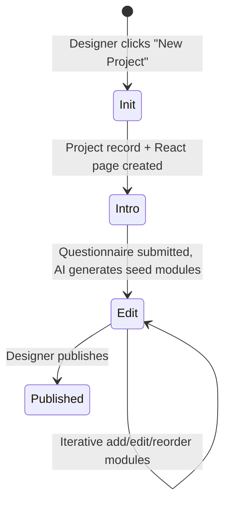

# Design Document: Onboarding Project Builder

## Overview

The Onboarding Project Builder is a full-stack web application that enables businesses (Designers — HR leads, team managers, L&D professionals) to create rich, interactive onboarding experiences for new employees (Joinees). Every project passes through three sequential stages: **Init** (scaffold), **Intro** (AI-seeded questionnaire), and **Edit** (iterative module workspace). Designers converse with an AI assistant during the Edit stage to refine structured onboarding projects composed of rich text, interactive visuals (Mermaid diagrams), and embedded code editors. Joinees consume the published projects through a shareable, account-free URL.

### Tech Stack

| Layer | Technology | Justification |
|---|---|---|
| Frontend Framework | **Next.js 14 (App Router)** | Server components reduce client bundle size; built-in API routes eliminate a separate backend service; excellent Vercel deployment story |
| Language | **TypeScript** | End-to-end type safety across frontend and backend; required for tRPC |
| Styling | **Tailwind CSS + shadcn/ui** | Rapid UI development with accessible, composable components |
| API Layer | **tRPC v11** | Type-safe RPC without code generation; eliminates REST boilerplate; shares types between client and server |
| AI Integration | **Vercel AI SDK (`ai` package)** | First-class streaming support; provider-agnostic (OpenAI/Anthropic); `useChat` hook simplifies chat UI; `streamObject` enables structured JSON output from LLM |
| LLM Provider | **OpenAI GPT-4o** | Strong instruction-following for structured content generation; JSON mode for reliable module/visual output |
| ORM | **Prisma** | Type-safe database client; schema-first migrations; excellent Next.js integration |
| Database | **PostgreSQL** | Relational model fits project/module hierarchy; JSONB columns for flexible module content |
| Code Execution | **Piston API** | Open-source, sandboxed, multi-language execution engine; supports Python, JavaScript, TypeScript; self-hostable |
| Interactive Visuals | **Mermaid.js** | Text-to-diagram rendering; AI can generate Mermaid syntax reliably; supports flowcharts, sequence diagrams, and annotated steps |
| Code Editor | **Monaco Editor (`@monaco-editor/react`)** | VS Code-grade editing experience; syntax highlighting for Python/JS/TS; large file performance |
| Rich Text | **Tiptap** | Headless, extensible rich text editor; React-native; ProseMirror-based |
| Auth | **NextAuth.js (Auth.js v5)** | Designer authentication; supports OAuth (Google/GitHub) and credentials; session management |
| State Management | **Zustand** | Lightweight client state for session revision history and UI state |
| Validation | **Zod** | Runtime schema validation shared between tRPC procedures and AI output schemas |
| Deployment | **Vercel** | Zero-config Next.js deployment; edge functions for low-latency AI streaming |

---

## Three-Stage Designer Workflow

Each project moves through three stages in sequence. The stage is stored on the `Project` record and gates which UI the Designer sees.



### Stage 1 — Init

**Trigger**: Designer submits the "New Project" form (title + description).

**What happens**:
1. `project.create` tRPC mutation fires, writing a `Project` row with `stage: "init"`.
2. The server scaffolds a blank module page entry in the database.
3. The client is redirected to `/builder/[projectId]/intro`.

**Key constraint**: No modules exist yet. The project is a shell.

---

### Stage 2 — Intro

**Trigger**: Designer lands on `/builder/[projectId]/intro`.

**What happens**:
1. The `IntroQuestionnaire` component renders three sections:
   - **Goals** — free-text: "What should a new employee know or be able to do after completing this?"
   - **Baseline Requirements** — checklist + free-text: "What prior knowledge can you assume?"
   - **Examples** — file upload or URL paste: "Share any existing docs, slides, or references."
2. On submit, the answers are sent to `POST /api/ai/intro` along with a predefined system prompt (the "Intro Rules") that instructs the AI on how to structure a learning module for business onboarding.
3. The AI returns a `SeedLayout` — an ordered list of module stubs (type + title + brief description) — within 15 seconds.
4. The stubs are written to the database as `Module` rows with `content: null` (placeholders).
5. The project `stage` is updated to `"edit"`.
6. The client is redirected to `/builder/[projectId]/edit`.

**Intro Rules (predefined AI system prompt)**:
- Always start with a "Welcome & Overview" rich-text module.
- Group related concepts into no more than 5–7 modules per project.
- Include at least one interactive visual if the goals mention processes, flows, or structures.
- Include at least one code exercise if the goals mention technical skills.
- Keep module titles concise (≤ 6 words).

---

### Stage 3 — Edit

**Trigger**: Designer lands on `/builder/[projectId]/edit` (stage must be `"edit"`).

**What happens**:
1. The Builder workspace loads with the AI-seeded module stubs pre-populated in the `PreviewPanel`.
2. The Designer iteratively fills in and refines each module using:
   - **Direct manipulation**: click a module stub to open its inline editor (Tiptap / Monaco / Mermaid).
   - **AI chat**: type instructions in the `ChatPanel` to add, modify, or restructure modules.
3. Every accepted change is auto-saved within 5 seconds.
4. When satisfied, the Designer publishes the project.

---

## Architecture

The system follows a **monorepo, full-stack Next.js** architecture. The Next.js App Router handles both the React frontend and the backend API (via tRPC route handlers and Server Actions). A single PostgreSQL database stores all persistent data. The Piston API runs as a separate service (self-hosted or via the public endpoint) for sandboxed code execution.

```mermaid
graph TB
    subgraph Browser
        D[Designer UI<br/>Init → Intro → Edit]
        J[Joinee UI<br/>Published Project]
    end

    subgraph Next.js App (Vercel)
        AR[App Router<br/>React Server Components]
        TR[tRPC Router<br/>/api/trpc]
        AI_CHAT[AI Chat Handler<br/>/api/ai/chat]
        AI_INTRO[AI Intro Handler<br/>/api/ai/intro]
        CE[Code Exec Proxy<br/>/api/execute]
    end

    subgraph External Services
        OAI[OpenAI GPT-4o]
        PISTON[Piston API<br/>Code Sandbox]
    end

    subgraph Data
        PG[(PostgreSQL<br/>via Prisma)]
        LS[Browser<br/>localStorage]
    end

    D -->|tRPC calls| TR
    D -->|streaming fetch| AI_CHAT
    D -->|questionnaire submit| AI_INTRO
    D -->|code submit| CE
    J -->|tRPC calls| TR
    J <-->|progress| LS
    AR --> PG
    TR --> PG
    AI_CHAT -->|stream| OAI
    AI_INTRO -->|stream| OAI
    CE --> PISTON
```

### Key Architectural Decisions

**Decision 1: Monolithic Next.js vs. Separate Backend**
A single Next.js app is chosen over a separate Express/Fastify backend. This reduces operational complexity for a business onboarding tool, keeps deployment simple (single Vercel project), and allows tRPC to share types without a separate package.

**Decision 2: Piston API for Code Execution**
Piston runs each submission in an isolated container with resource limits, satisfying the sandboxing requirement. The 15-second timeout is enforced at the proxy layer (`/api/execute`) before forwarding to Piston, giving us control independent of Piston's own limits.

**Decision 3: Mermaid.js for Interactive Visuals**
The AI can reliably generate Mermaid syntax (it appears in training data extensively). Mermaid renders to SVG in the browser, is responsive by default, and supports the required visual types (flowcharts, sequence diagrams, annotated steps). Custom click/hover interactivity is layered on top via Mermaid's `securityLevel` and event callbacks.

**Decision 4: Structured AI Output via `streamObject`**
Rather than asking the AI to return free-form text, the AI route uses Vercel AI SDK's `streamObject` with a Zod schema. This ensures the AI always returns a valid `ProposedChange` object (module additions, edits, deletions) that can be directly applied to the project state.

---

## Components and Interfaces

### Frontend Components

```
src/
├── app/
│   ├── (auth)/
│   │   └── login/page.tsx                  # Designer login
│   ├── dashboard/
│   │   └── page.tsx                        # Project list
│   ├── builder/[projectId]/
│   │   ├── intro/page.tsx                  # Stage 2: Intro questionnaire
│   │   └── edit/page.tsx                   # Stage 3: Edit workspace
│   └── p/[slug]/
│       └── page.tsx                        # Joinee public view
├── components/
│   ├── init/
│   │   └── NewProjectForm.tsx              # Stage 1: title + description form
│   ├── intro/
│   │   ├── IntroQuestionnaire.tsx          # Goals / baseline / examples form
│   │   ├── GoalsInput.tsx                  # Free-text goals field
│   │   ├── BaselineChecklist.tsx           # Prior knowledge checklist
│   │   └── ExamplesUpload.tsx              # File/URL reference input
│   ├── builder/
│   │   ├── ChatPanel.tsx                   # AI conversation interface (Edit stage)
│   │   ├── PreviewPanel.tsx                # Live project preview
│   │   ├── ProposedChangeCard.tsx          # Approve/reject UI
│   │   └── RevisionHistoryBar.tsx          # Undo control
│   ├── modules/
│   │   ├── ModuleStub.tsx                  # Placeholder card for AI-seeded modules
│   │   ├── RichTextModule.tsx              # Tiptap editor/viewer
│   │   ├── VisualModule.tsx                # Mermaid renderer + interactions
│   │   └── CodeEditorModule.tsx            # Monaco editor + run button
│   ├── joinee/
│   │   ├── ModuleList.tsx                  # Ordered module navigation
│   │   ├── ProgressBar.tsx                 # Completion indicator
│   │   └── ModuleViewer.tsx                # Read-only module renderer
│   └── ui/                                 # shadcn/ui primitives
├── server/
│   ├── trpc/
│   │   ├── router/
│   │   │   ├── project.ts                  # Project CRUD + stage transitions
│   │   │   ├── module.ts                   # Module CRUD + reorder
│   │   │   └── session.ts                  # Session management
│   │   └── index.ts                        # Root tRPC router
│   └── db/
│       └── prisma.ts                       # Prisma client singleton
└── lib/
    ├── ai/
    │   ├── schemas.ts                      # Zod schemas for AI output
    │   ├── prompts.ts                      # Edit-stage system prompt templates
    │   └── introRules.ts                   # Predefined Intro-stage AI rules
    └── piston.ts                           # Piston API client
```

### tRPC Procedures

```typescript
// Project Router
project.create(input: { title: string; description: string }) → Project
project.list() → Project[]
project.getById(input: { id: string }) → Project & { modules: Module[] }
project.update(input: { id: string; title?: string; description?: string }) → Project
project.delete(input: { id: string }) → { success: boolean }
project.publish(input: { id: string }) → { slug: string; url: string }

// Module Router
module.add(input: { projectId: string; type: ModuleType; position: number }) → Module
module.update(input: { id: string; content: ModuleContent }) → Module
module.reorder(input: { projectId: string; orderedIds: string[] }) → Module[]
module.delete(input: { id: string }) → { success: boolean }

// Session Router
session.create(input: { projectId: string }) → Session
session.applyChange(input: { sessionId: string; change: ProposedChange }) → Project
session.undo(input: { sessionId: string }) → Project
```

### AI Route Handler

`POST /api/ai/chat` — Accepts a conversation history and current project state, streams back a `ProposedChange` object using `streamObject`.

```typescript
// Request body
{
  messages: CoreMessage[];       // conversation history
  projectSnapshot: ProjectSnapshot; // current project state for context
}

// Streamed response (Zod-validated)
ProposedChange = {
  type: "add_module" | "update_module" | "delete_module" | "update_project_meta";
  description: string;           // human-readable summary shown to designer
  payload: ModuleAddPayload | ModuleUpdatePayload | ModuleDeletePayload | MetaUpdatePayload;
}
```

### Code Execution Proxy

`POST /api/execute` — Validates input, enforces 15-second timeout, proxies to Piston API.

```typescript
// Request
{ language: "python" | "javascript" | "typescript"; code: string }

// Response
{ stdout: string; stderr: string; exitCode: number; timedOut: boolean }
```

---

## Data Models

### Prisma Schema

```prisma
model User {
  id        String   @id @default(cuid())
  email     String   @unique
  name      String?
  image     String?
  projects  Project[]
  sessions  Session[]
  createdAt DateTime @default(now())
}

model Project {
  id          String    @id @default(cuid())
  title       String
  description String    @default("")
  slug        String?   @unique          // set on publish
  published   Boolean   @default(false)
  ownerId     String
  owner       User      @relation(fields: [ownerId], references: [id], onDelete: Cascade)
  modules     Module[]
  sessions    Session[]
  createdAt   DateTime  @default(now())
  updatedAt   DateTime  @updatedAt
}

model Module {
  id        String      @id @default(cuid())
  projectId String
  project   Project     @relation(fields: [projectId], references: [id], onDelete: Cascade)
  type      ModuleType
  title     String      @default("Untitled Module")
  position  Int                           // 0-indexed ordering
  content   Json                          // ModuleContent (see below)
  createdAt DateTime    @default(now())
  updatedAt DateTime    @updatedAt

  @@index([projectId, position])
}

model Session {
  id        String   @id @default(cuid())
  projectId String
  project   Project  @relation(fields: [projectId], references: [id], onDelete: Cascade)
  userId    String
  user      User     @relation(fields: [userId], references: [id], onDelete: Cascade)
  history   Json     @default("[]")      // RevisionEntry[]
  createdAt DateTime @default(now())
  updatedAt DateTime @updatedAt
}

enum ModuleType {
  RICH_TEXT
  INTERACTIVE_VISUAL
  CODE_EDITOR
}
```

### TypeScript Content Types

```typescript
// Discriminated union stored in Module.content (JSONB)
type ModuleContent =
  | RichTextContent
  | InteractiveVisualContent
  | CodeEditorContent;

interface RichTextContent {
  type: "RICH_TEXT";
  html: string;          // Tiptap HTML output
}

interface InteractiveVisualContent {
  type: "INTERACTIVE_VISUAL";
  visualType: "flowchart" | "sequence" | "annotated_steps";
  mermaidDefinition: string;   // raw Mermaid syntax
  annotations: Annotation[];   // hover/click metadata
}

interface Annotation {
  nodeId: string;        // Mermaid node ID
  label: string;
  detail: string;
}

interface CodeEditorContent {
  type: "CODE_EDITOR";
  language: "python" | "javascript" | "typescript";
  starterCode: string;
  solution?: string;
  hint?: string;
  expectedOutput?: string;
}

// Revision history entry stored in Session.history
interface RevisionEntry {
  timestamp: string;
  changeDescription: string;
  snapshotBefore: ProjectSnapshot;  // full project state before change
}

// Lightweight project snapshot for AI context and undo
interface ProjectSnapshot {
  id: string;
  title: string;
  description: string;
  modules: Array<{
    id: string;
    type: ModuleType;
    title: string;
    position: number;
    content: ModuleContent;
  }>;
}
```

### Client-Side Progress (localStorage)

```typescript
// Key: `opb_progress_${projectSlug}`
interface JoineeProgress {
  projectSlug: string;
  completedModuleIds: string[];
  lastVisited: string;  // ISO timestamp
}
```

---

## Correctness Properties

*A property is a characteristic or behavior that should hold true across all valid executions of a system — essentially, a formal statement about what the system should do. Properties serve as the bridge between human-readable specifications and machine-verifiable correctness guarantees.*

### Property 1: Project list completeness

*For any* Designer and any set of projects they have created, the list returned by `project.list()` should contain exactly those projects — no projects from other designers, and no missing projects.

**Validates: Requirements 1.2, 1.3**

---

### Property 2: Published project URL uniqueness

*For any* set of published Onboarding Projects, all generated slugs/URLs should be distinct — no two projects share the same shareable URL.

**Validates: Requirements 1.6**

---

### Property 3: Approve-then-retrieve round trip

*For any* proposed change approved by the Designer, the project state retrieved from the database immediately after approval should reflect that change exactly.

**Validates: Requirements 2.5**

---

### Property 4: Undo restores previous state

*For any* sequence of accepted changes within a Session, applying undo should restore the project to the exact state it was in before the most recently accepted change (round-trip invariant on revision history).

**Validates: Requirements 2.7**

---

### Property 5: Module order preservation

*For any* reordering of modules specified by the Designer, the order stored in the database and the order presented to the Joinee should be identical to the specified order.

**Validates: Requirements 3.4, 6.2**

---

### Property 6: Module ID uniqueness

*For any* number of modules added to a project, all assigned module IDs should be unique — no two modules within the same project share an ID.

**Validates: Requirements 3.2**

---

### Property 7: Code editor configuration round trip

*For any* valid Code_Editor configuration (language, starter code, optional solution, optional hint), storing it and then retrieving it should produce a configuration equal to the original.

**Validates: Requirements 5.2**

---

### Property 8: Error message safety

*For any* code submission that produces a runtime error, the error message displayed to the Joinee should not contain internal system details (server file paths, stack traces referencing internal modules, environment variables, or server hostnames).

**Validates: Requirements 5.6**

---

### Property 9: Progress indicator accuracy

*For any* combination of completed and incomplete modules, the progress indicator should display a count equal to the number of completed module IDs in the Joinee's progress record, out of the total module count.

**Validates: Requirements 6.5**

---

### Property 10: Progress persistence round trip

*For any* set of modules marked complete by a Joinee, the completion state written to localStorage should be fully recoverable after a page refresh — no completed modules should be lost or incorrectly added.

**Validates: Requirements 6.4**

---

## Competitive Landscape

| Dimension | Onboarding Project Builder | Notion AI | Trainual | Confluence | Codecademy for Business |
|---|---|---|---|---|---|
| AI-generated structured modules | Yes — AI produces typed, Zod-validated module objects (not free-form text) | Partial — inline AI text generation, no structured output | No AI generation | No AI generation | No AI generation |
| Approve/reject AI loop with undo | Yes — Designer reviews each change before it's applied; snapshot-based undo | No — AI writes inline, no approval step | N/A | N/A | N/A |
| Embedded code execution | Yes — Monaco Editor + Piston sandboxed execution (Python/JS/TS) | No | No | No | Yes — but only within Codecademy's platform |
| Interactive diagrams | Yes — Mermaid.js with hover/click annotations, AI-generated | No (static images only) | No | Partial (draw.io embed, not AI-generated) | No |
| Account-free Joinee access | Yes — shareable URL, no sign-up required | Requires workspace access | Requires account | Requires account | Requires account |
| Three-stage guided creation | Yes — Init → Intro questionnaire → Edit | No structured workflow | Template-based, no AI seeding | No structured workflow | Course builder (manual) |
| Target audience | Businesses, small teams | General-purpose | SMB HR teams | Enterprise teams | Enterprise L&D |

### Why We Win

The primary alternative a business Designer would use today is Notion — create a page, write content manually, maybe use Notion AI to generate some paragraphs, then share a link. The Onboarding Project Builder produces a better outcome because: (1) the three-stage workflow with AI seeding means the Designer gets a structured first draft in 30 seconds instead of starting from a blank page, (2) the approve/reject loop gives the Designer control over AI output that Notion's inline generation lacks, (3) interactive Mermaid diagrams and sandboxed code exercises are impossible in Notion, and (4) the Joinee experience — with progress tracking, module completion, and no-account access — is purpose-built for onboarding rather than adapted from a general-purpose doc tool.

---

## `session.applyChange` Transaction Design

The `session.applyChange` procedure is the most complex write path in the system. It must atomically: (1) snapshot the current project state, (2) append a `RevisionEntry` to the `Session.history` JSONB array, and (3) apply the change to the affected `Module` and/or `Project` rows. This is implemented as a Prisma interactive transaction:

```typescript
async function applyChange(sessionId: string, change: ProposedChange) {
  return prisma.$transaction(async (tx) => {
    // 1. Load current session and project state
    const session = await tx.session.findUniqueOrThrow({
      where: { id: sessionId },
      include: { project: { include: { modules: { orderBy: { position: "asc" } } } } },
    });

    // 2. Snapshot current state for undo
    const snapshotBefore: ProjectSnapshot = {
      id: session.project.id,
      title: session.project.title,
      description: session.project.description,
      modules: session.project.modules.map((m) => ({
        id: m.id, type: m.type, title: m.title, position: m.position, content: m.content,
      })),
    };

    // 3. Append RevisionEntry to Session.history JSONB
    const history = (session.history as RevisionEntry[]) || [];
    history.push({
      timestamp: new Date().toISOString(),
      changeDescription: change.description,
      snapshotBefore,
    });
    await tx.session.update({
      where: { id: sessionId },
      data: { history },
    });

    // 4. Apply the change to Module/Project rows
    switch (change.type) {
      case "add_module":
        await tx.module.create({ data: { ... } });
        break;
      case "update_module":
        await tx.module.update({ where: { id: change.payload.moduleId }, data: { ... } });
        break;
      case "delete_module":
        await tx.module.delete({ where: { id: change.payload.moduleId } });
        break;
    }

    // 5. Return updated project
    return tx.project.findUniqueOrThrow({
      where: { id: session.projectId },
      include: { modules: { orderBy: { position: "asc" } } },
    });
  });
}
```

The `$transaction` block ensures that if any step fails (e.g., the module ID doesn't exist for an update), the entire operation rolls back — the `Session.history` is not appended, and no `Module` rows are modified. This guarantees the undo invariant (Property 4).

---

## Scalability Considerations

**JSONB History Pruning**: The `Session.history` column stores full `ProjectSnapshot` objects per revision, which grows unboundedly. Mitigation: cap history at 50 entries per session; when the cap is reached, prune the oldest entries. For long-lived projects, archive old sessions to a separate `ArchivedSession` table.

**Module Count Soft Limits**: Projects are soft-limited to 20 modules. The Intro AI rules already cap at 5–7 modules, and the UI displays a warning at 15+ modules. This prevents `ProjectSnapshot` objects from becoming excessively large.

**Pagination on Project List**: `project.list` currently returns all projects for a Designer. For Designers with 50+ projects, add cursor-based pagination (Prisma `cursor` + `take`) to avoid loading all projects on dashboard load.

**localStorage → Server-Side Progress Migration**: Joinee progress is stored in localStorage for zero-friction access. If Joinee accounts become desirable (e.g., for manager dashboards showing completion rates), the migration path is: (1) add a `JoineeProgress` Prisma model, (2) on first authenticated visit, import localStorage data into the DB, (3) fall back to localStorage for unauthenticated Joinees.

**Neon Connection Pooling**: The Neon serverless adapter (`@neondatabase/serverless`) uses WebSocket-based connections with built-in PgBouncer pooling. At 10x expected load, Neon auto-scales compute and the pooler handles connection multiplexing transparently.

---

## Module Type Extensibility

The module type system is currently a closed set (`RICH_TEXT | INTERACTIVE_VISUAL | CODE_EDITOR`). To add a new module type (e.g., quiz, video embed, form) without modifying the core schema:

1. The `Module.type` field is a `String` (not an enum) in the actual Prisma schema, allowing new types without a migration.
2. The `Module.content` field is `Json`, so any new content shape can be stored without schema changes.
3. To add a new type: (a) define a new `TypeContent` interface in `src/lib/types.ts`, (b) add a new editor component in `src/components/modules/`, (c) add a new preview component in `src/components/preview/`, (d) extend `buildSystemPrompt()` with the new type's field rules, (e) extend the `ChangeSchema` Zod schema.

This pattern means the database schema never needs to change for new module types — only TypeScript code and UI components.

---

## Risk Register

| Risk | Likelihood | Impact | Mitigation | Fallback |
|---|---|---|---|---|
| **AI API rate limits or cost overruns** during demo with concurrent users | High | High | Per-user rate limiting (20 req/min); set xAI spending cap; cache repeated prompts | Disable AI chat; Designers use manual module editing (Tiptap/Monaco/Mermaid editors still work without AI) |
| **AI consistently fails to produce valid `ProposedChange`** (Zod validation failure) | Medium | Medium | Single retry with amended prompt; flat schema design maximizes AI compliance | Show error message; Designer retries with more specific instruction; manual editing always available |
| **Piston API unavailable** on demo day | Medium | High | Self-host Piston as Docker container; `PISTON_API_URL` env var for easy switching | Return 503 with "Code execution temporarily unavailable"; code editor still works for viewing/editing, just can't run |
| **Monaco/Mermaid SSR crash** in Next.js | Medium | Medium | Lazy-load both with `next/dynamic({ ssr: false })`; already implemented | Show fallback skeleton; raw Mermaid syntax displayed as code block |
| **Vercel function timeout** conflicts with 15s Piston timeout | Low | Medium | Set `maxDuration: 30` on execute route; `AbortController` at 15s is well within Vercel's 30s limit | Timeout message displayed to Joinee |
| **Demo-day degraded mode** (AI + Piston both down) | Low | High | Pre-populate a demo project with all three module types before the demo | The entire editor UI, preview, publish flow, and Joinee view work without AI or Piston — only AI chat and code execution are affected |

---

## Error Handling

### AI Response Failures
- If the OpenAI API returns an error or times out, the chat route returns a structured error message to the Designer: `"The AI assistant is temporarily unavailable. Please try again."`
- Partial streamed responses are discarded; the Designer's message is retained in the chat history so they can retry.
- The `ProposedChange` Zod schema validation failure (malformed AI output) triggers a retry with an amended system prompt instructing the model to fix its output format.

### Auto-Save Failures (Requirement 7.3)
- Auto-save uses an optimistic write pattern: the UI reflects the accepted change immediately.
- If the tRPC `applyChange` mutation fails, a toast notification informs the Designer: `"Auto-save failed. Your changes are preserved in this session."`
- The unsaved `RevisionEntry` is held in Zustand state and retried with exponential backoff (1s, 2s, 4s) up to 3 times.
- If all retries fail, the Designer is prompted to manually copy their work or reload.

### Code Execution Errors
- **Timeout (>15s)**: The `/api/execute` proxy uses `AbortController` with a 15-second timeout. On abort, it returns `{ timedOut: true, stdout: "", stderr: "Execution timed out after 15 seconds." }`.
- **Runtime errors**: Piston returns stderr output. The proxy strips any lines containing internal Piston container paths (matching `/piston/jobs/...`) before forwarding to the client.
- **Sandbox unavailable**: If Piston is unreachable, the proxy returns a 503 with a user-facing message: `"Code execution is temporarily unavailable."`.

### Module Deletion with Unsaved Content (Requirement 3.5)
- The `module.delete` tRPC procedure checks if the module has a pending unsaved diff in the active session.
- If unsaved content exists, the procedure returns a `PRECONDITION_FAILED` tRPC error, which the frontend intercepts to show a confirmation dialog.

### Project Deletion Confirmation (Requirement 1.4)
- Deletion is a two-step tRPC call: `project.requestDelete` (returns a confirmation token) → `project.confirmDelete(token)`.
- The token expires after 60 seconds, preventing accidental deletion from stale UI state.

---

## Testing Strategy

### Dual Testing Approach

Both unit/example-based tests and property-based tests are used. Unit tests cover specific scenarios, integration points, and error conditions. Property-based tests verify universal invariants across randomized inputs.

### Property-Based Testing

**Library**: [fast-check](https://fast-check.dev/) (TypeScript-native, excellent arbitrary generators, 100+ iterations by default).

Each property test runs a minimum of **100 iterations**. Tests are tagged with a comment referencing the design property they validate.

```
Tag format: // Feature: onboarding-project-builder, Property {N}: {property_text}
```

**Property tests to implement:**

| Property | Test File | What's Generated |
|---|---|---|
| P1: Project list completeness | `project.property.test.ts` | Random sets of projects per designer |
| P2: URL uniqueness | `project.property.test.ts` | Random sets of published projects |
| P3: Approve-then-retrieve round trip | `session.property.test.ts` | Random `ProposedChange` payloads |
| P4: Undo restores previous state | `session.property.test.ts` | Random sequences of changes |
| P5: Module order preservation | `module.property.test.ts` | Random module lists + permutations |
| P6: Module ID uniqueness | `module.property.test.ts` | Random counts of module additions |
| P7: Code editor config round trip | `module.property.test.ts` | Random valid `CodeEditorContent` |
| P8: Error message safety | `execute.property.test.ts` | Random error-producing code snippets |
| P9: Progress indicator accuracy | `progress.property.test.ts` | Random completed/total module counts |
| P10: Progress persistence round trip | `progress.property.test.ts` | Random sets of completed module IDs |

### Unit / Example-Based Tests

- **Project CRUD**: create, read, update, delete with concrete examples
- **Auth guards**: verify unauthenticated requests to designer routes are rejected
- **Publish flow**: publish a project and verify slug generation and public accessibility
- **Module content types**: create one module of each type and verify rendering
- **Code execution**: submit Python/JS/TS code and verify output (integration test against Piston)
- **Timeout behavior**: submit an infinite loop and verify timeout message
- **Hint/solution reveal**: configure a solution, fail an attempt, verify reveal works
- **Auto-save failure**: mock a failed tRPC mutation and verify toast + retry behavior
- **Joinee no-auth access**: access a published project URL without a session cookie

### Integration Tests

- **End-to-end AI session**: send a natural language instruction and verify a `ProposedChange` is returned within 10 seconds (mocked OpenAI response)
- **Auto-save timing**: accept a change and verify database write occurs within 5 seconds
- **Code execution latency**: submit code and verify output within 15 seconds

### Smoke Tests

- **Database connectivity**: verify Prisma can connect and run a simple query
- **Piston availability**: verify the Piston API endpoint responds to a health check
- **Preview panel renders**: verify the builder workspace loads with both chat and preview panels visible
- **Responsive visuals**: verify Mermaid diagrams render at 375px (mobile) and 1280px (desktop) viewports

---

## Sprints and Milestones

### Sprint 1 — Foundation (Week 1–2)
**Goal**: Working auth, project CRUD, and database schema.

- Set up Next.js 14 project with TypeScript, Tailwind, shadcn/ui
- Configure Prisma + PostgreSQL schema (User, Project, Module, Session)
- Implement NextAuth.js with Google OAuth for Designer login
- Build tRPC router: `project.create`, `project.list`, `project.getById`, `project.update`, `project.delete`
- Build Dashboard page (project list + create/delete UI)
- Write unit tests for project CRUD procedures

**Milestone**: Designer can log in, create projects, and see them listed.

---

### Sprint 2 — Builder Workspace & AI Integration (Week 3–4)
**Goal**: Working chat interface with AI-proposed changes and live preview.

- Build Builder workspace layout (split-pane: ChatPanel + PreviewPanel)
- Implement `/api/ai/chat` route with Vercel AI SDK `streamObject` and Zod `ProposedChange` schema
- Implement `ProposedChangeCard` (approve/reject UI)
- Implement `session.applyChange` and `session.undo` tRPC procedures
- Implement Zustand store for revision history
- Implement auto-save with retry logic (Requirement 7)
- Write property tests P3 (approve round trip) and P4 (undo)

**Milestone**: Designer can chat with AI, approve/reject changes, and undo.

---

### Sprint 3 — Module Types (Week 5–6)
**Goal**: All three module content types are functional.

- Implement `RichTextModule` with Tiptap editor
- Implement `VisualModule` with Mermaid.js rendering + hover/click annotations
- Implement `CodeEditorModule` with Monaco Editor
- Implement `/api/execute` proxy with 15-second timeout and error sanitization
- Implement module add/reorder/delete tRPC procedures
- Write property tests P5 (order), P6 (ID uniqueness), P7 (config round trip), P8 (error safety)

**Milestone**: Designer can add all three module types; Joinees can run code.

---

### Sprint 4 — Joinee Experience & Publishing (Week 7–8)
**Goal**: Published projects are accessible and trackable by Joinees.

- Implement `project.publish` tRPC procedure (slug generation)
- Build Joinee public view (`/p/[slug]`) with no-auth access
- Implement `ModuleList`, `ModuleViewer`, `ProgressBar` components
- Implement localStorage progress persistence
- Write property tests P1 (list completeness), P2 (URL uniqueness), P9 (progress accuracy), P10 (progress persistence)
- Write smoke tests for responsive visuals and no-auth access

**Milestone**: Joinees can access published projects, complete modules, and track progress.

---

### Sprint 5 — Polish, Error Handling & QA (Week 9–10)
**Goal**: Production-ready error handling, edge cases, and full test coverage.

- Implement two-step project deletion confirmation
- Implement unsaved-content guard on module deletion
- Implement auto-save failure toast + retry UI
- Implement code execution timeout message and error sanitization
- Implement hint/solution reveal flow
- Full integration test suite (AI session latency, auto-save timing, code execution)
- Accessibility audit (keyboard navigation, ARIA labels)
- Performance review (bundle size, Mermaid lazy loading, Monaco lazy loading)

**Milestone**: All requirements met; test suite green; ready for deployment.
