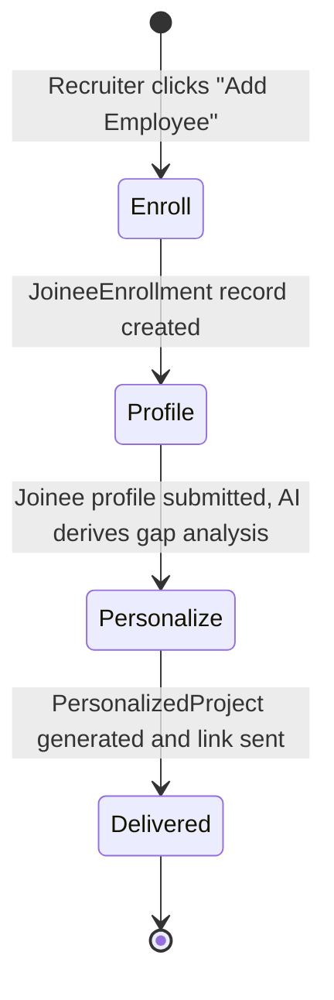

# Design Document: Personalized Onboarding Engine

## Overview

The Personalized Onboarding Engine extends the existing Onboarding Project Builder by introducing a second lifecycle that operates on already-published generalized onboarding projects. Recruiters enroll new employees (Joinees) by submitting a structured profile; the system then uses AI to derive a **PersonalizedProject** — a joinee-specific adaptation of the generalized project that adjusts content depth, examples, exercises, and learning path based on the individual's background. The goal is that every joinee, regardless of starting level, reaches the same competency benchmark by the end of their onboarding.

### Actors

| Actor | Role |
|---|---|
| **Developer** | Builds the generalized onboarding project using the existing Init → Intro → Edit workflow |
| **Recruiter** | HR or team lead who enrolls new employees and triggers personalization |
| **Joinee / Employee** | Receives a personalized project URL and completes it at their own pace |

### Design Principle

The generalized project is never modified. Personalization produces a read-only, joinee-scoped copy that references the source project. Changes by the Developer to the source project do not automatically propagate to in-progress personalized projects, preventing disruption to active learners.

---

### Tech Stack

All layers from the Onboarding Project Builder are inherited. The additions below are specific to the Personalized Onboarding Engine.

| Layer | Technology | Justification |
|---|---|---|
| Frontend Framework | **Next.js 14 (App Router)** | Inherited; recruiter and personalized joinee views are new App Router segments |
| Language | **TypeScript** | Inherited |
| Styling | **Tailwind CSS + shadcn/ui** | Inherited |
| API Layer | **tRPC v11** | Inherited; new routers added for joinee and personalization workflows |
| AI Integration | **Vercel AI SDK (`ai` package)** | `streamObject` used for structured personalization plan generation |
| LLM Provider | **OpenAI GPT-4o** | Reliable JSON-mode output for generating per-module adaptation payloads |
| ORM | **Prisma** | Inherited; schema extended with new models |
| Database | **PostgreSQL** | Inherited; JSONB columns for flexible personalization payloads |
| Code Execution | **Piston API** | Inherited; personalized code modules may swap language |
| Interactive Visuals | **Mermaid.js** | Inherited |
| Code Editor | **Monaco Editor** | Inherited |
| Rich Text | **Tiptap** | Inherited (read-only mode used for personalized modules) |
| Auth | **NextAuth.js (Auth.js v5)** | Extended: Recruiters authenticate with the same OAuth flow as Designers; Joinees remain account-free |
| State Management | **Zustand** | Inherited; extended for personalized project progress |
| Validation | **Zod** | Inherited; new schemas for joinee profiles and personalization plans |
| Deployment | **Vercel** | Inherited |

---

## Three-Stage Recruiter Workflow

Each enrollment moves through three sequential stages. The stage is stored on the `JoineeEnrollment` record and gates which UI the Recruiter sees.



### Stage 1 — Enroll

**Trigger**: Recruiter opens a published generalized project and clicks "Add Employee".

**What happens**:
1. `enrollment.create` tRPC mutation fires, writing a `JoineeEnrollment` row with `stage: "ENROLL"` linked to the source `Project`.
2. The client is redirected to `/recruiter/enrollments/[enrollmentId]/profile`.

**Key constraint**: The source project must have `published: true` and `stage: "EDIT"` (i.e., fully built by the Developer). Attempting to enroll against an unpublished project returns a `PRECONDITION_FAILED` error.

---

### Stage 2 — Profile

**Trigger**: Recruiter lands on `/recruiter/enrollments/[enrollmentId]/profile`.

**What happens**:
1. The `JoineeProfileForm` component renders five sections:
   - **Identity** — name, email address, and job title.
   - **Role Context** — which team and function the joinee is joining; what their day-to-day responsibilities will be.
   - **Prior Experience** — years of relevant experience, previous roles, and domains worked in.
   - **Skill Self-Assessment** — checklist derived from the source project's module titles; the recruiter marks which topics the joinee already knows well, partially knows, or has never encountered.
   - **Learning Preferences** — preferred programming language (if the project contains code modules), preferred explanation style (conceptual-first vs. example-first), and any accessibility needs.
2. On submit, the profile data is sent to `POST /api/ai/personalize` alongside the full `ProjectSnapshot` of the source project.
3. The AI returns a `PersonalizationPlan` — an ordered list of `PersonalizedModuleSpec` objects describing, for each source module, what adaptation is required — within 20 seconds.
4. The `PersonalizationPlan` is written to the `JoineeEnrollment` record.
5. The enrollment `stage` is updated to `"PERSONALIZE"`.
6. The client is redirected to `/recruiter/enrollments/[enrollmentId]/personalize`.

**Personalization Rules (predefined AI system prompt)**:

The AI operates as an **Adaptive Learning Architect** and executes a four-phase reasoning pipeline before producing output:

**Phase 1 — Profile Analysis**: Classify the joinee's overall readiness (NOVICE / INTERMEDIATE / SENIOR) from years of experience and self-assessment distribution. Identify strongest and weakest domains, note explanation style preference and preferred language.

**Phase 2 — Gap Analysis**: For each source module, cross-reference the joinee's self-assessment against the module's implicit prerequisites to determine whether the module should be adapted, fast-tracked, or preceded by a supplemental.

**Phase 3 — Path Construction**: Arrange the output module sequence respecting the dependency graph, verify the module count cap, and ensure the competency anchor is in place.

**Phase 4 — Content Adaptation**: Generate full adapted content for each module following the adaptation matrix and depth calibration guidelines.

**Hard Constraints** (violations invalidate the output):
- **HC-1 Full Coverage**: Every source module must map to at least one output spec (standard, fast_track, or advanced). No silent drops.
- **HC-2 Module Count Cap**: Total output specs ≤ `floor(1.5 × sourceModuleCount)`. If supplementals would exceed the cap, merge the lowest-priority supplementals into condensed notes on their target module.
- **HC-3 Competency Anchor**: The final output module must be `"standard"` or `"advanced"` and correspond to the last source module — the uniform competency checkpoint.
- **HC-4 Fast-Track Quiz**: Every `"fast_track"` module must include a `selfCheckQuiz` with 2–5 scenario-based questions testing application, not recall.
- **HC-5 Supplemental Ordering**: A supplemental's position must be strictly less than the position of the source module it prepares the joinee for.
- **HC-6 Position Integrity**: Positions must be a zero-indexed contiguous sequence (0, 1, 2, ..., n-1).

**Adaptation Matrix**:

| Self-Assessment | Overall Readiness | → adaptationType | → contentDepth |
|---|---|---|---|
| proficient | any | fast_track | (recap only) |
| partial | NOVICE | standard | foundational |
| partial | INTERMEDIATE | standard | standard |
| partial | SENIOR | standard | advanced |
| none | NOVICE | standard* | foundational |
| none | INTERMEDIATE | standard* | standard |
| none | SENIOR | standard | standard |

\* = insert supplemental before this module if it has cross-module dependencies.

**Soft Heuristics** (follow unless overridden by a hard constraint or recruiter note):
- Swap code module language to the joinee's preference if Piston supports it; otherwise retain the source language with an explanatory note.
- Align explanation style: `"conceptual_first"` learners get theory → examples; `"example_first"` learners get scenarios → principles.
- Calibrate depth: `"foundational"` = first principles + analogies; `"standard"` = concise with working vocabulary; `"advanced"` = edge cases + design trade-offs.
- Supplementals are RICH_TEXT or INTERACTIVE_VISUAL only, ≤ 500 words, ending with a bridge sentence.
- Tailor examples to the joinee's role context (team, responsibilities) when available.

**Edge Cases**: All-proficient profiles keep the Welcome module at standard depth; all-none profiles add supplementals only where genuine cross-module dependencies exist; single-module projects adapt in-place with no supplementals.

---

### Stage 3 — Personalize

**Trigger**: Recruiter lands on `/recruiter/enrollments/[enrollmentId]/personalize`.

**What happens**:
1. The `PersonalizationReviewPanel` renders each `PersonalizedModuleSpec` as a card showing: source module title, adaptation type, content depth, and a short AI rationale.
2. The Recruiter may:
   - **Approve all** — accepts the full plan as-is.
   - **Edit individual specs** — override adaptation type or content depth for any module before accepting.
   - **Regenerate** — discard the current plan and resubmit the profile with an amended note to the AI.
3. On approval, `enrollment.approve` tRPC mutation fires:
   - Generates a `PersonalizedProject` record linked to the enrollment.
   - Generates one `PersonalizedModule` row per spec, with AI-adapted content rendered inline.
   - Sets a unique `joineeSlug` on the enrollment.
   - Sends the joinee an onboarding email containing their personalized project URL (`/learn/[joineeSlug]`).
4. The enrollment `stage` is updated to `"DELIVERED"`.

---

## Architecture

The Personalized Onboarding Engine is an additive extension to the existing Next.js monorepo. No existing routes or data models are modified.

```mermaid
graph TB
    subgraph Browser
        R[Recruiter UI<br/>Enroll → Profile → Personalize]
        J[Joinee UI<br/>/learn/joineeSlug]
    end

    subgraph Next.js App (Vercel)
        AR[App Router<br/>React Server Components]
        TR[tRPC Router<br/>/api/trpc]
        AI_P[AI Personalize Handler<br/>/api/ai/personalize]
        CE[Code Exec Proxy<br/>/api/execute]
        MAIL[Email Handler<br/>/api/notify/joinee]
    end

    subgraph External Services
        OAI[OpenAI GPT-4o]
        PISTON[Piston API<br/>Code Sandbox]
        SMTP[SMTP / Resend<br/>Transactional Email]
    end

    subgraph Data
        PG[(PostgreSQL<br/>via Prisma)]
        LS[Browser<br/>localStorage]
    end

    R -->|tRPC calls| TR
    R -->|profile submit| AI_P
    J -->|tRPC calls| TR
    J <-->|progress| LS
    J -->|code submit| CE
    TR --> PG
    AR --> PG
    AI_P -->|streamObject| OAI
    CE --> PISTON
    TR -->|on approve| MAIL
    MAIL --> SMTP
```

### Key Architectural Decisions

**Decision 1: Personalized projects are copies, not live views**
The `PersonalizedModule` rows store fully rendered content at generation time rather than reading from the source project on demand. This ensures the joinee's experience is stable even if the Developer later edits the source project, and allows language-swapped or supplemental modules that have no equivalent source row.

**Decision 2: Recruiter review before delivery**
The AI-generated `PersonalizationPlan` is presented to the Recruiter for approval before any content is sent to the joinee. This gives a human checkpoint to catch incorrect skill assessments or inappropriate difficulty levels without requiring the joinee to notice and report the problem themselves.

**Decision 3: Supplemental modules for knowledge gaps**
Rather than lowering the bar for less experienced joinees, the system inserts short prerequisite modules that bring them up to the level required for the source content. The final assessment module is identical across all personalized projects for the same source, enforcing a uniform competency benchmark.

**Decision 4: Email delivery via transactional provider**
The personalized project URL is delivered by email (Resend or any SMTP-compatible provider) rather than requiring the joinee to log into a portal. This keeps the joinee experience account-free, consistent with the existing public joinee view design.

---

## Components and Interfaces

### Frontend Components

```
src/
├── app/
│   ├── recruiter/
│   │   ├── dashboard/
│   │   │   └── page.tsx                        # Enrollment list for recruiter
│   │   └── enrollments/[enrollmentId]/
│   │       ├── profile/page.tsx                # Stage 2: Joinee profile form
│   │       └── personalize/page.tsx            # Stage 3: Plan review + approve
│   └── learn/[joineeSlug]/
│       └── page.tsx                            # Personalized joinee view
├── components/
│   ├── recruiter/
│   │   ├── EnrollmentList.tsx                  # List of all enrollments per project
│   │   ├── NewEnrollmentButton.tsx             # Triggers enrollment.create
│   │   ├── JoineeProfileForm.tsx               # Stage 2: full profile input
│   │   ├── IdentitySection.tsx                 # Name / email / title
│   │   ├── RoleContextSection.tsx              # Team / responsibilities
│   │   ├── PriorExperienceSection.tsx          # Years / domains / roles
│   │   ├── SkillAssessmentChecklist.tsx        # Per-module self-assessment
│   │   ├── LearningPreferencesSection.tsx      # Language / style / accessibility
│   │   ├── PersonalizationReviewPanel.tsx      # Stage 3: plan card list
│   │   ├── ModuleSpecCard.tsx                  # Individual spec: type + depth + rationale
│   │   └── RegenerateDialog.tsx                # Discard plan + add note + resubmit
│   └── learn/
│       ├── PersonalizedModuleList.tsx          # Ordered navigation with adaptation badges
│       ├── PersonalizedModuleViewer.tsx        # Renders adapted content (all three types)
│       ├── AdaptationBadge.tsx                 # "Fast Track" / "Supplemental" / "Advanced" label
│       ├── SelfCheckQuiz.tsx                   # Quiz shown on fast-tracked modules
│       └── ProgressBar.tsx                     # Inherited; scoped to personalized module count
```

### tRPC Procedures

```typescript
// Enrollment Router
enrollment.create(input: { projectId: string }) → JoineeEnrollment
enrollment.list(input: { projectId: string }) → JoineeEnrollment[]
enrollment.getById(input: { id: string }) → JoineeEnrollment & { personalizedProject?: PersonalizedProject }
enrollment.submitProfile(input: { id: string; profile: JoineeProfile }) → PersonalizationPlan
enrollment.updateSpec(input: { enrollmentId: string; moduleSpecId: string; patch: Partial<PersonalizedModuleSpec> }) → PersonalizationPlan
enrollment.approve(input: { id: string }) → { joineeSlug: string; learnUrl: string }
enrollment.regenerate(input: { id: string; note: string }) → PersonalizationPlan

// PersonalizedProject Router
personalizedProject.getBySlug(input: { joineeSlug: string }) → PersonalizedProject & { modules: PersonalizedModule[] }
personalizedProject.getProgress(input: { joineeSlug: string }) → JoineeProgress   // reads localStorage on client
```

### AI Personalize Route Handler

`POST /api/ai/personalize` — Accepts a joinee profile and the source project snapshot, streams back a `PersonalizationPlan` using `streamObject`.

```typescript
// Request body
{
  profile: JoineeProfile;
  projectSnapshot: ProjectSnapshot;   // reused from existing type
  regenerateNote?: string;            // optional recruiter note on regeneration
}

// Streamed response (Zod-validated)
PersonalizationPlan = {
  summary: string;                    // human-readable rationale shown to recruiter
  specs: PersonalizedModuleSpec[];
}

PersonalizedModuleSpec = {
  sourceModuleId: string | null;      // null for supplemental modules with no source
  title: string;
  position: number;                   // 0-indexed; determines final order
  adaptationType: "standard" | "fast_track" | "supplemental" | "advanced";
  contentDepth: "foundational" | "standard" | "advanced";
  language?: "python" | "javascript" | "typescript";  // code modules only
  rationale: string;                  // ≤ 2 sentences, shown in ModuleSpecCard
  adaptedContent: ModuleContent;      // fully rendered content for this joinee
}
```

### Notification Handler

`POST /api/notify/joinee` — Called internally by `enrollment.approve`; sends the joinee their personalized project URL.

```typescript
// Internal request (not exposed to clients)
{
  toEmail: string;
  toName: string;
  learnUrl: string;
  projectTitle: string;
}
// Returns: { messageId: string }
```

---

## Data Models

### Prisma Schema Extensions

The following models are added. Existing models (`User`, `Project`, `Module`, `Session`) are unchanged.

```prisma
model Joinee {
  id          String              @id @default(cuid())
  email       String              @unique
  name        String
  jobTitle    String
  enrollments JoineeEnrollment[]
  createdAt   DateTime            @default(now())
  updatedAt   DateTime            @updatedAt
}

model JoineeEnrollment {
  id                  String              @id @default(cuid())
  joineeId            String
  joinee              Joinee              @relation(fields: [joineeId], references: [id], onDelete: Cascade)
  sourceProjectId     String
  sourceProject       Project             @relation(fields: [sourceProjectId], references: [id], onDelete: Restrict)
  stage               EnrollmentStage     @default(ENROLL)
  profile             Json?               // JoineeProfile
  personalizationPlan Json?               // PersonalizationPlan
  joineeSlug          String?             @unique
  personalizedProject PersonalizedProject?
  deliveredAt         DateTime?
  createdAt           DateTime            @default(now())
  updatedAt           DateTime            @updatedAt

  @@index([sourceProjectId])
  @@index([joineeId])
}

model PersonalizedProject {
  id           String              @id @default(cuid())
  enrollmentId String              @unique
  enrollment   JoineeEnrollment    @relation(fields: [enrollmentId], references: [id], onDelete: Cascade)
  title        String
  modules      PersonalizedModule[]
  createdAt    DateTime            @default(now())
  updatedAt    DateTime            @updatedAt
}

model PersonalizedModule {
  id                   String              @id @default(cuid())
  personalizedProjectId String
  personalizedProject  PersonalizedProject @relation(fields: [personalizedProjectId], references: [id], onDelete: Cascade)
  sourceModuleId       String?             // null for supplemental modules
  type                 ModuleType
  title                String
  position             Int
  adaptationType       AdaptationType
  contentDepth         ContentDepth
  content              Json                // ModuleContent (same discriminated union)
  createdAt            DateTime            @default(now())
  updatedAt            DateTime            @updatedAt

  @@index([personalizedProjectId, position])
}

enum EnrollmentStage {
  ENROLL
  PROFILE
  PERSONALIZE
  DELIVERED
}

enum AdaptationType {
  STANDARD
  FAST_TRACK
  SUPPLEMENTAL
  ADVANCED
}

enum ContentDepth {
  FOUNDATIONAL
  STANDARD
  ADVANCED
}
```

### TypeScript Profile and Plan Types

```typescript
// Stored in JoineeEnrollment.profile (JSONB)
interface JoineeProfile {
  identity: {
    name: string;
    email: string;
    jobTitle: string;
  };
  roleContext: {
    team: string;
    responsibilities: string;
  };
  priorExperience: {
    yearsRelevant: number;
    previousRoles: string[];
    domains: string[];
  };
  skillAssessment: SkillAssessmentEntry[];
  learningPreferences: {
    preferredLanguage: "python" | "javascript" | "typescript" | null;
    explanationStyle: "conceptual_first" | "example_first";
    accessibilityNeeds: string;
  };
}

interface SkillAssessmentEntry {
  sourceModuleId: string;
  moduleTitle: string;
  knowledgeLevel: "none" | "partial" | "proficient";
}

// Stored in JoineeEnrollment.personalizationPlan (JSONB)
interface PersonalizationPlan {
  summary: string;
  specs: PersonalizedModuleSpec[];
}

interface PersonalizedModuleSpec {
  sourceModuleId: string | null;
  title: string;
  position: number;
  adaptationType: "standard" | "fast_track" | "supplemental" | "advanced";
  contentDepth: "foundational" | "standard" | "advanced";
  language?: "python" | "javascript" | "typescript";
  rationale: string;
  adaptedContent: ModuleContent;
}

// Self-check quiz appended to fast-tracked modules
interface SelfCheckQuiz {
  questions: QuizQuestion[];
}

interface QuizQuestion {
  prompt: string;
  options: string[];
  correctIndex: number;
  explanation: string;
}
```

### Client-Side Progress (localStorage)

The existing `JoineeProgress` shape is reused, scoped to the `joineeSlug` instead of the project slug.

```typescript
// Key: `opb_progress_${joineeSlug}`
interface JoineeProgress {
  joineeSlug: string;
  completedModuleIds: string[];
  quizResults: QuizResult[];   // additional field for fast-track self-checks
  lastVisited: string;         // ISO timestamp
}

interface QuizResult {
  moduleId: string;
  passed: boolean;
  attemptedAt: string;
}
```

---

## Correctness Properties

### Property 1: Source project immutability

*For any* approved enrollment, the source `Project` and its `Module` rows must be unchanged after the `PersonalizedProject` is generated — no fields on the source records may be mutated or deleted as a side effect of enrollment or approval.

**Validates**: Design principle that the generalized project is never modified.

---

### Property 2: Module coverage completeness

*For any* approved `PersonalizationPlan`, the resulting `PersonalizedModule` rows must include a module derived from every source module — either as a `STANDARD`, `FAST_TRACK`, or `ADVANCED` entry. No source module may be absent from the personalized project.

**Validates**: Personalization Rules clause "every source module must appear in the output".

---

### Property 3: Supplemental module insertion ordering

*For any* supplemental module inserted before a source module at position *k*, the supplemental module's `position` value must be strictly less than the adapted version of that source module's `position` value in the final `PersonalizedModule` list.

**Validates**: Prerequisite supplemental modules always precede the content they prepare the joinee for.

---

### Property 4: Competency benchmark uniformity

*For any* two enrollments against the same source `Project`, both resulting `PersonalizedProject` records must contain a final module of `adaptationType: "STANDARD"` or `"ADVANCED"` that shares its `sourceModuleId` with the final module of the source project — regardless of the joinees' differing profiles.

**Validates**: Personalization Rules clause "the final module must always verify the same competency benchmark".

---

### Property 5: Fast-track quiz presence

*For any* `PersonalizedModule` with `adaptationType: "FAST_TRACK"`, the module's `content` must contain a `SelfCheckQuiz` with at least one question. A fast-tracked module without a quiz is invalid.

**Validates**: Fast-track modules verify proficiency rather than silently skipping content.

---

### Property 6: Joinee slug uniqueness

*For any* set of approved enrollments, all assigned `joineeSlug` values must be distinct — no two enrollments share the same personalized project URL.

**Validates**: Each joinee receives a unique, non-conflicting access link.

---

### Property 7: Profile-to-plan round trip

*For any* submitted `JoineeProfile`, storing it and then retrieving it via `enrollment.getById` must produce a profile equal to the original — no fields lost, reordered, or type-coerced.

**Validates**: Recruiter-submitted profile data is faithfully persisted for audit and regeneration.

---

### Property 8: Enrollment isolation

*For any* two enrollments against the same source project, approving one enrollment must not alter the `PersonalizedProject` or `PersonalizedModule` records belonging to the other enrollment.

**Validates**: Enrollments are fully independent; one joinee's personalization does not affect another's.

---

### Property 9: Module count upper bound

*For any* source project with *n* modules and any approved `PersonalizationPlan` for it, the total number of `PersonalizedModule` rows (including supplementals) must be at most `floor(1.5 × n)`.

**Validates**: Personalization Rules clause capping supplemental expansion.

---

### Property 10: Progress persistence round trip

*For any* set of modules marked complete (and quiz results recorded) by a Joinee, the state written to localStorage must be fully recoverable after a page refresh — no completed module IDs lost and no quiz results incorrectly added or removed.

**Validates**: Joinee progress is durable across sessions without a server-side account.

---

## Error Handling

### AI Personalization Failures
- If the OpenAI API returns an error or the response exceeds 20 seconds, the personalize route returns a structured error: `"Personalization is temporarily unavailable. The profile has been saved — please try again."`.
- The `JoineeProfile` is persisted to the enrollment record before the AI call; the recruiter does not need to re-enter the form on retry.
- If the returned `PersonalizationPlan` fails Zod schema validation (malformed AI output), the route retries once with an amended system prompt instructing the model to fix its output format. After two consecutive failures, the recruiter is shown an error with a "Regenerate" option.

### Missing Source Module Coverage (Property 2 violation)
- Before writing `PersonalizedModule` rows, the `enrollment.approve` procedure validates that every source `Module` ID appears in at least one spec's `sourceModuleId`. If any source module is missing, the approval is rejected with a `PRECONDITION_FAILED` error and the recruiter is shown which modules the plan failed to cover, with a prompt to regenerate.

### Enrollment Against Unpublished Project
- `enrollment.create` checks `project.published === true`. If the source project is not published, it returns a `PRECONDITION_FAILED` error: `"This project is not yet published. Ask the Developer to publish it before enrolling employees."`.

### Email Delivery Failure
- If the SMTP/Resend call in `/api/notify/joinee` fails, the `enrollment.approve` mutation still completes and the `joineeSlug` is set. The API returns the `learnUrl` to the Recruiter UI, which displays it inline with a copy button and a warning: `"The welcome email could not be sent. Share this link with the employee directly."`.
- The delivery failure is recorded on the `JoineeEnrollment` record (`deliveredAt` remains `null`) so the Recruiter dashboard can surface undelivered enrollments.

### Spec Override Conflicts
- If a Recruiter manually overrides a module spec's `contentDepth` to `"advanced"` for a joinee who self-assessed as `"none"` in that topic, the UI shows a warning: `"This joinee has no prior experience in this topic. Advanced depth may hinder their progress."` The Recruiter may proceed; the override is recorded in the spec's `rationale` field.

### Module Count Cap Violation (Property 9 violation)
- If the AI returns more than `floor(1.5 × n)` specs, the personalize route strips excess supplemental specs (lowest-priority by position) and appends a warning to `PersonalizationPlan.summary` that some supplemental content was trimmed. The recruiter is informed and may regenerate with a note to reduce supplemental depth.

---

## Testing Strategy

### Dual Testing Approach

Both unit/example-based tests and property-based tests are used, inheriting the approach from the Onboarding Project Builder.

### Property-Based Testing

**Library**: [fast-check](https://fast-check.dev/).

Each property test runs a minimum of **100 iterations**. Tests are tagged with a comment referencing the design property they validate.

```
Tag format: // Feature: personalized-onboarding-engine, Property {N}: {property_text}
```

**Property tests to implement:**

| Property | Test File | What's Generated |
|---|---|---|
| P1: Source project immutability | `enrollment.property.test.ts` | Random profiles + enrollments against a fixed source project |
| P2: Module coverage completeness | `personalization.property.test.ts` | Random profiles producing varied plan specs |
| P3: Supplemental insertion ordering | `personalization.property.test.ts` | Random source module lists with random gap profiles |
| P4: Competency benchmark uniformity | `personalization.property.test.ts` | Random pairs of profiles against the same source project |
| P5: Fast-track quiz presence | `personalization.property.test.ts` | Random plans with varying `fast_track` module counts |
| P6: Joinee slug uniqueness | `enrollment.property.test.ts` | Random sets of approved enrollments |
| P7: Profile-to-plan round trip | `enrollment.property.test.ts` | Random `JoineeProfile` objects |
| P8: Enrollment isolation | `enrollment.property.test.ts` | Random pairs of concurrent enrollments |
| P9: Module count upper bound | `personalization.property.test.ts` | Random source project sizes and supplemental counts |
| P10: Progress persistence round trip | `progress.property.test.ts` | Random sets of completed module IDs and quiz results |

### Unit / Example-Based Tests

- **Enrollment CRUD**: create, retrieve, and list enrollments per project with concrete examples
- **Auth guard — Recruiter routes**: verify that unauthenticated requests to `/recruiter/**` are rejected
- **Auth guard — Joinee learn routes**: verify that `/learn/[joineeSlug]` is accessible without authentication
- **Profile submission**: submit a complete `JoineeProfile` and verify it is stored exactly on the enrollment
- **Plan approval**: approve a plan and verify that `PersonalizedProject` and `PersonalizedModule` rows are created
- **Spec override**: override one module spec's depth and verify the override is reflected in the final `PersonalizedModule`
- **Regenerate**: discard a plan, submit with a note, and verify a new `PersonalizationPlan` replaces the previous one
- **Email delivery — success**: mock SMTP success and verify `deliveredAt` is set and `joineeSlug` is returned
- **Email delivery — failure**: mock SMTP failure and verify `deliveredAt` remains null and the URL is surfaced in the response
- **Undelivered enrollments dashboard**: verify that enrollments with `deliveredAt: null` appear in the Recruiter dashboard under "Pending Delivery"
- **Fast-track quiz rendering**: load a personalized project with a fast-tracked module and verify the `SelfCheckQuiz` renders
- **Quiz result persistence**: pass a quiz, reload the page, and verify `quizResults` in localStorage matches

### Integration Tests

- **End-to-end personalization**: submit a profile and verify a `PersonalizationPlan` is returned within 20 seconds (mocked OpenAI response)
- **Coverage completeness check**: submit a plan missing one source module ID and verify `enrollment.approve` returns `PRECONDITION_FAILED`
- **Module count cap enforcement**: mock an AI response with `2n` specs and verify the route trims to `floor(1.5 × n)` and annotates the summary

### Smoke Tests

- **Database connectivity**: verify new Prisma models (`Joinee`, `JoineeEnrollment`, `PersonalizedProject`, `PersonalizedModule`) are reachable
- **Recruiter dashboard renders**: verify the enrollment list loads for a logged-in Recruiter
- **Personalized learn view renders**: verify `/learn/[joineeSlug]` loads with the correct module count and adaptation badges
- **AdaptationBadge display**: verify `FAST_TRACK`, `SUPPLEMENTAL`, and `ADVANCED` badges render at 375px and 1280px viewports

---

## Sprints and Milestones

### Sprint 1 — Schema and Recruiter Auth (Week 1–2)
**Goal**: New data models in place; Recruiter can log in and see the enrollment dashboard.

- Extend Prisma schema with `Joinee`, `JoineeEnrollment`, `PersonalizedProject`, `PersonalizedModule`, and new enums
- Run and validate migrations against the existing database
- Extend NextAuth.js to recognize `RECRUITER` role (stored on `User` record); gate `/recruiter/**` routes
- Build tRPC `enrollment.create` and `enrollment.list` procedures
- Build Recruiter dashboard page (`/recruiter/dashboard`) listing enrollments per project
- Write unit tests for enrollment CRUD and auth guard

**Milestone**: Recruiter can log in, open a published project, and create an enrollment record.

---

### Sprint 2 — Joinee Profile Collection (Week 3–4)
**Goal**: Recruiter can submit a complete joinee profile.

- Build `JoineeProfileForm` with all five sections (`IdentitySection`, `RoleContextSection`, `PriorExperienceSection`, `SkillAssessmentChecklist`, `LearningPreferencesSection`)
- `SkillAssessmentChecklist` dynamically populates from the source project's module titles via `enrollment.getById`
- Implement `enrollment.submitProfile` tRPC procedure; persist `JoineeProfile` to JSONB column
- Advance enrollment `stage` to `PERSONALIZE` on successful profile submission
- Write unit tests for profile submission and profile-to-plan round trip (P7)

**Milestone**: Recruiter can fill in and submit a full joinee profile; profile is persisted.

---

### Sprint 3 — AI Personalization Pipeline (Week 5–6)
**Goal**: AI generates a valid `PersonalizationPlan`; Recruiter can review and approve.

- Implement `POST /api/ai/personalize` route with `streamObject` and Zod `PersonalizationPlan` schema
- Implement module count cap enforcement and missing-coverage detection in the route
- Build `PersonalizationReviewPanel` with `ModuleSpecCard` per spec
- Build `RegenerateDialog` for plan discard + note + resubmit
- Implement `enrollment.approve` tRPC procedure: validate coverage (P2), write `PersonalizedProject` + `PersonalizedModule` rows, generate `joineeSlug`
- Write property tests P1 (source immutability), P2 (coverage completeness), P4 (benchmark uniformity), P9 (count cap)

**Milestone**: Recruiter can review the AI plan, override specs, and approve; `PersonalizedProject` is written to the database.

---

### Sprint 4 — Personalized Joinee View and Email Delivery (Week 7–8)
**Goal**: Joinees receive their URL and can access their personalized project.

- Build `/learn/[joineeSlug]` page with `PersonalizedModuleList` and `PersonalizedModuleViewer`
- Implement `AdaptationBadge` for `FAST_TRACK`, `SUPPLEMENTAL`, and `ADVANCED` module types
- Implement `SelfCheckQuiz` component for fast-tracked modules
- Extend localStorage progress schema with `quizResults`; implement `ProgressBar` scoped to personalized module count
- Implement `/api/notify/joinee` handler (Resend or SMTP); wire into `enrollment.approve`
- Build "Pending Delivery" section in Recruiter dashboard for enrollments with `deliveredAt: null`
- Write property tests P3 (supplemental ordering), P5 (fast-track quiz), P6 (slug uniqueness), P10 (progress persistence)

**Milestone**: Joinees receive email, open their URL, complete modules, and track progress; fast-tracked modules require quiz completion.

---

### Sprint 5 — Error Handling, Edge Cases, and QA (Week 9–10)
**Goal**: Production-ready error handling; full test coverage; deployment verified.

- Implement all error handling cases: AI failure with profile preservation, missing coverage rejection, email delivery fallback, spec override conflict warning, module count trimming
- Write integration tests for end-to-end personalization latency, coverage completeness check, and module count cap enforcement
- Write smoke tests for all new routes and components at mobile and desktop viewports
- Accessibility audit for Recruiter and Joinee views (keyboard navigation, ARIA labels on adaptation badges and quiz options)
- Performance review: verify personalized project load does not regress Joinee view time beyond 200ms relative to the public project view baseline

**Milestone**: All properties hold; test suite green; Recruiter and Joinee flows are production-ready.
